# JNI开发。
**1.基础数据类型**

**java：**

    **boolean** **1个字节**

    **byte**          **1个字节**

    **char        2个字节**

    **short**         **2个字节**

    **int**               **4个字节**

    **long**           **8个字节**

    **float**           **4个字节**

    **double**      **8个字节**

**C：**

    **char        1个字节**

    **short**         **2个字节**

    **int**               **4个字节**

    **long**           4**个字节**

    **float**           **4个字节**

    **double**      **8个字节**

有无符号只能用来修饰整形变量：char、short、int、long，默认有符号。

**singed() 有符号数，最高位是符号位，可以表示负数，但是表示的最大值相对要小;**

**unsinged() 无符号数，最高位是数值位，不可以表示负数，表示的最大值相对要大;**

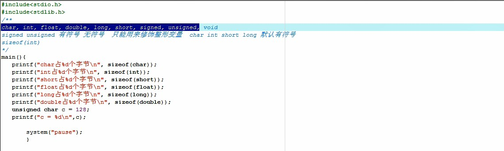


**2.输出函数占位符**

**%d     int（整形）**

**%ld    long-int（长整型）**

**%lld   long-long\*\***%hd   短整形（short-int）\*\*\*\*\*\*\*\*\*\*\*\*\*\*

**%c     char**

**%f      float**

**%lf     double**

**%u     无符号数**

**%x     十六进制输出int或者long-int或者short-int**

**%o     八进制输出**

---
**%s     字符串s**

**注意：%#x --------->   #是添加一个前缀0。**

           **%.7lf ----------> .7就是让double输出7位小数。默认的是输出6位有效数字小数。**

            **char   cArray\[\] = {'a','b','\\0'}; ---------->  \\0 结束符，C的数组不检测下标越界。这种写法不能输入汉字，因为一个char是一个字节。**

---
            **char   cArray\[\] = "你好"； -----------> 可以输入汉字。**

            \*\*\*\*\*\*\*\*\*\*\*\*\*\*\*\*\*\*\*\*\*\***print("cArray = %s",cArray);  ----->打印。**

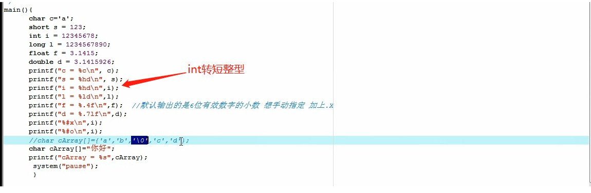


**3.输入函数**

**scanf("占位符",内存地址)**

**例如：**


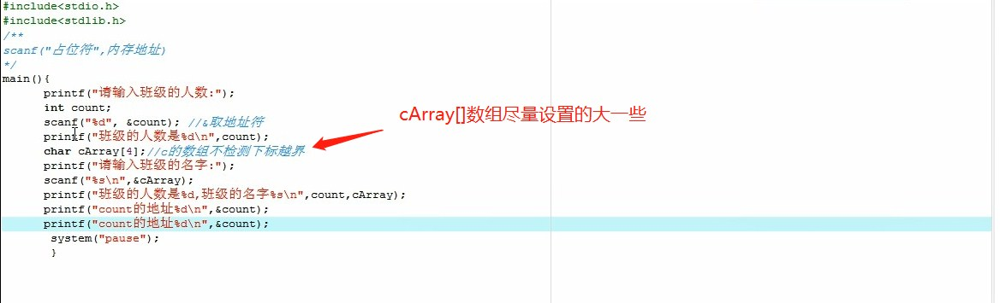

\*\*\*\*\*\*\*\*\*\*\*\*\*\*\*\*\*\*\*\*\*\*

 **4.指针**

      **注意：1.使用之前要初始化，赋给它一个自己程序中声明的变量的地址。不然就是野指针会报错。**

                       2.int类型的指针要指向int类型的内存地址，double类型的指针要指向double类型的地址，不然会出BUG。        

                 3.

---
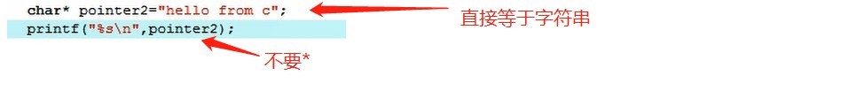

**& 取地址符**

**int\*   int类型的指针变量地址**

**void\*  可以指向任意类型的指针变量地址**

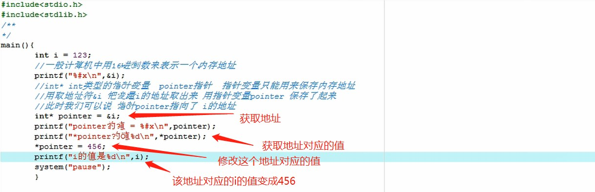


5.通过指针进行数值转换，并在main中返回子函数的多个值打印出来。

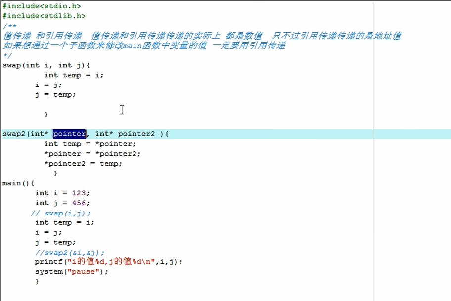


6.数组与指针之间的关系

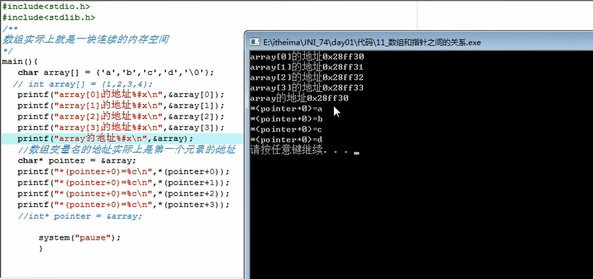


7.指针变量的长度

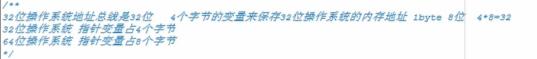


8.结构体（struct）

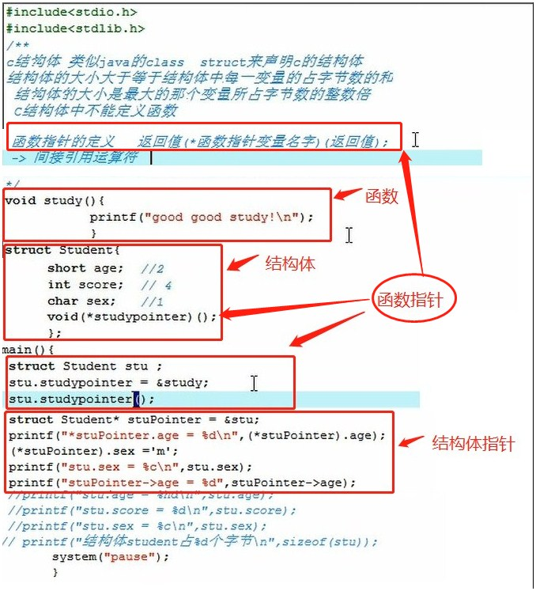


---
9.联合体（union）（使用场景：在嵌入式设备上节省内存的作用）

---
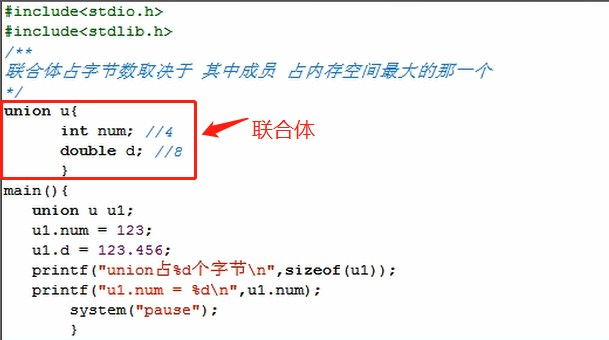


---
10.枚举（enum）

例1：

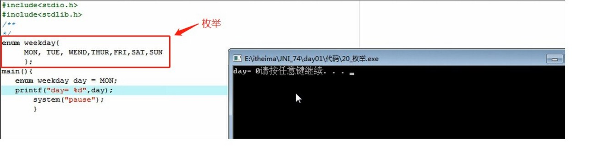

        **例2：**


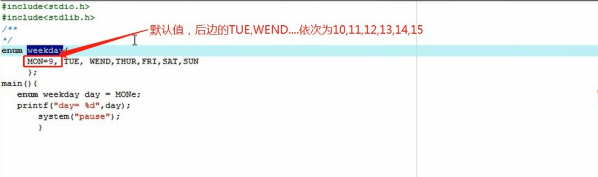

---
11.自定义类型（typedef）

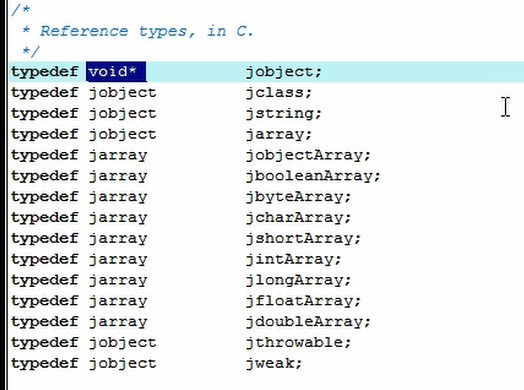


---
12.NDK（Native develop kit）目录

    **docs**文件夹  **帮助文档。**

    **platforms**文件夹  **多平台版本文件夹 --》开发选择时：选择项目支持的最小版本号对应的文件夹。**

                                                                          每一个版本号的文件夹中放了不同cpu架构的资源文件：


**\--》**

**include**文件夹**：jni开发常用的 .h头文件**


**\--》\*\*\*\*lib**文件夹**：google打包好的，提供给开发者使用的 .so文件。**


     **samples**文件夹   \*\*\*\*\*\*\*\*\*\*\*\*\*\*\*\*\*\*\*\*\*\*\*\*\*\*

google官方提供的样例工具，可以参考进行开发。

\*\*\*\*\*\*\*\*\*\*\*\*\*\*\*\*\*\*\*\*\*\*\*\*\*\*     **build\\tools**文件夹   

---
linux系统下的批处理文件，系统在交叉编译的时候会自动调用。

---
**★**ndk-build.cmd文件\*\*   \*\*\*\*\*\*\*\*\*\*\*\*\*\*\*\*\*\*\*\*\*\*\*\*\*\*\*\*

交叉编译的命令（ndk-build）：编译C的代码译成Android可以使用的.so文件。（需要配到环境变量里）

---
13.JNIHelloWorld （jni开发步骤） 


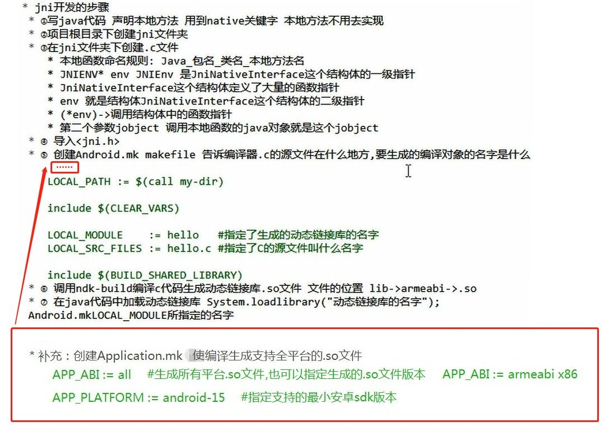

**★jni文件夹下样例：**  

        hello.c文件样例：

```cpp
#include <stdlib.h>
#include <jni.h>
#include <android/log.h>
#define LOG_TAG "System.out"
#define LOGD(...) __android_log_print(ANDROID_LOG_DEBUG, LOG_TAG, __VA_ARGS__)
#define LOGI(...) __android_log_print(ANDROID_LOG_INFO, LOG_TAG, __VA_ARGS__)

//jstring
//Java_com_example_hellojni_HelloJni_stringFromJNI( JNIEnv* env,
//                                                  jobject thiz )
//JNIEnv* env 是结构体JNINativeInterface 的二级指针
// JNIEnv 是结构体JNINativeInterface 的一级指针
// JNINativeInterface结构体中定义了大量的函数指针 这些函数指针在jni开发中很常用
// (*env)->
//jobject  调用本地函数的java对象 在这个例子中 就是MainActivity的实例
//c本地函数命名规则  Java_包名_类名_本地方法名
//jstring     (*NewStringUTF)(JNIEnv*, const char*);
jstring Java_com_yunwanjia_myapplication_MainActivity_helloFromC(JNIEnv* env,jobject thiz){
    char* cstr = "hello from c!";
    return (*env)->NewStringUTF(env,cstr);
}
```
        Android.mk文件样例：

```cpp
LOCAL_PATH := $(call my-dir)

    include $(CLEAR_VARS)

    LOCAL_MODULE    := hello
    LOCAL_SRC_FILES := hello.c

    LOCAL_LDLIBS += -llog

    include $(BUILD_SHARED_LIBRARY)
```
        **Application.mk文件样例：**

```cpp
APP_ABI := all
APP_PLATFORM := android-15
```
**★交叉编译命令样例：**        \*\*


        生成文件样例：  

\*\*

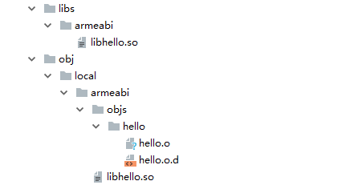

---
**★Activity文件样例：**  

```java
package com.yunwanjia.myapplication;

import android.support.v7.app.AppCompatActivity;
import android.os.Bundle;
import android.view.View;
import android.widget.Toast;

public class MainActivity extends AppCompatActivity {
    static {
        System.loadLibrary("hello");
    }

    @Override
    protected void onCreate(Bundle savedInstanceState) {
        super.onCreate(savedInstanceState);
        setContentView(R.layout.activity_main);
    }

    public void click(View view){
        String result = helloFromC();
        Toast.makeText(getApplicationContext(),result,Toast.LENGTH_SHORT).show();
    }

    public native String helloFromC();
}
```
**★build.gradle配置libs：**  

```cpp
android {
    sourceSets {
        main {
            jni.srcDirs = []
            jniLibs.srcDirs = ['libs']
        }
    }
}
```
14.JNI开发常见错误


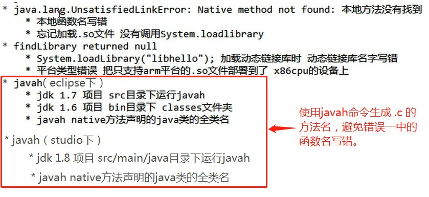

**★javcah命令样例：**    

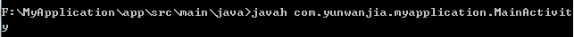


15.JNI数据传递  


**★将java传过来的String数据转换成C的char类型，然后C处理后返回给java：**  

        **hello.c文件样例：**

```cpp
#include <stdlib.h>
#include <jni.h>
#include <android/log.h>
#define LOG_TAG "System.out"
#define LOGD(...) __android_log_print(ANDROID_LOG_DEBUG, LOG_TAG, __VA_ARGS__)
#define LOGI(...) __android_log_print(ANDROID_LOG_INFO, LOG_TAG, __VA_ARGS__)

/**
 * 把一个jstring转换成一个c语言的char* 类型.
 */
char* _JString2CStr(JNIEnv* env, jstring jstr) {
     char* rtn = NULL;
     jclass clsstring = (*env)->FindClass(env, "java/lang/String");
     jstring strencode = (*env)->NewStringUTF(env,"GB2312");
     jmethodID mid = (*env)->GetMethodID(env, clsstring, "getBytes", "(Ljava/lang/String;)[B");
     jbyteArray barr = (jbyteArray)(*env)->CallObjectMethod(env, jstr, mid, strencode); // String .getByte("GB2312");
     jsize alen = (*env)->GetArrayLength(env, barr);
     jbyte* ba = (*env)->GetByteArrayElements(env, barr, JNI_FALSE);
     if(alen > 0) {
        rtn = (char*)malloc(alen+1); //"\0"
        memcpy(rtn, ba, alen);
        rtn[alen]=0;
     }
     (*env)->ReleaseByteArrayElements(env, barr, ba,0);
     return rtn;
}


jstring Java_com_yunwanjia_myapplication_JDK_sayHelloInc(JNIEnv* env,jobject thiz,jstring s){
    char* cstr = _JString2CStr(env,s);
    int length = strlen(cstr);
    int i;
    for(i = 0;i < length;i++){
        *(cstr + i) += 1;
    }
    return (*env)->NewStringUTF(env,cstr);
}
```
        **JDK.java文件样例：**

```java
package com.yunwanjia.myapplication;

public class JDK {

    static {
        System.loadLibrary("hello");
    }

    //传递String类型的参数给C 处理一下返回来
    public static native String sayHelloInc(String s);

}
```
       **MainActivity.java文件样例：**

```java
    public void click2(View view) {
        String s = JDK.sayHelloInc("abcd");
        Toast.makeText(getApplicationContext(),s,Toast.LENGTH_SHORT).show();
    }
```
**★将java传过来的int数组转换成C的数据类型，然后C处理后返回给java：**  

        **hello.c文件样例：**  

```cpp
#include <stdlib.h>
#include <jni.h>
#include <android/log.h>
#define LOG_TAG "System.out"
#define LOGD(...) __android_log_print(ANDROID_LOG_DEBUG, LOG_TAG, __VA_ARGS__)
#define LOGI(...) __android_log_print(ANDROID_LOG_INFO, LOG_TAG, __VA_ARGS__)


jintArray Java_com_yunwanjia_myapplication_JDK_arrElementsIncrease(JNIEnv* env, jobject clazz, jintArray jArray){
    //jsize       (*GetArrayLength)(JNIEnv*, jarray);
    jsize length =(*env)->GetArrayLength(env,jArray);
    LOGD("length = %d",length);
    //jboolean iscopy;
    //jint*       (*GetIntArrayElements)(JNIEnv*, jintArray, jboolean*);
    jint* arrayPointer =(*env)->GetIntArrayElements(env,jArray,NULL);
    int i;
    for(i = 0;i<length;i++){
        *(arrayPointer+i) += 10;
        LOGD("length = %d",*(arrayPointer+i));
    }
    (*env)->SetIntArrayRegion(env, jArray, 0,length,arrayPointer);
    return jArray;
}
```
        **JDK.java文件样例：**

```java
package com.yunwanjia.myapplication;

public class JDK {

    static {
        System.loadLibrary("hello");
    }

    //传递int数据类型的参数给C 处理一下返回来
    public static native int[] arrElementsIncrease(int[] intArray);

}
```
       **MainActivity.java文件样例：**

```java
    public void click3(View view) {
        int[] ints = new int[]{1, 2, 3, 4, 5};
        int[] arrElementsIncrease = JDK.arrElementsIncrease(ints);
        for(int i : arrElementsIncrease){
            Log.e("test",i + "");
        }
    }
```
\*\*16.JNI引入logcat日志打印
\*\*

        **Android.mk文件加入：**

```cpp
    LOCAL_LDLIBS += -llog
```
        **hello.c文件样例：**

```cpp
#include <stdlib.h>
#include <jni.h>
#include <android/log.h>
#define LOG_TAG "System.out"
#define LOGD(...) __android_log_print(ANDROID_LOG_DEBUG, LOG_TAG, __VA_ARGS__)
#define LOGI(...) __android_log_print(ANDROID_LOG_INFO, LOG_TAG, __VA_ARGS__)


jintArray Java_com_yunwanjia_myapplication_JDK_arrElementsIncrease(JNIEnv* env, jobject clazz, jintArray jArray){
    //jsize       (*GetArrayLength)(JNIEnv*, jarray);
    jsize length =(*env)->GetArrayLength(env,jArray);
    LOGD("length = %d",length);
    return jArray;
}
```