# android内存优化。
**一.内存优化介绍及工具**  

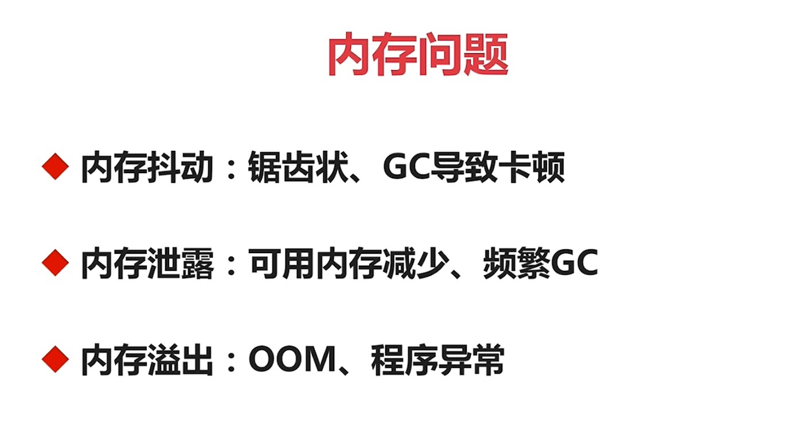

  

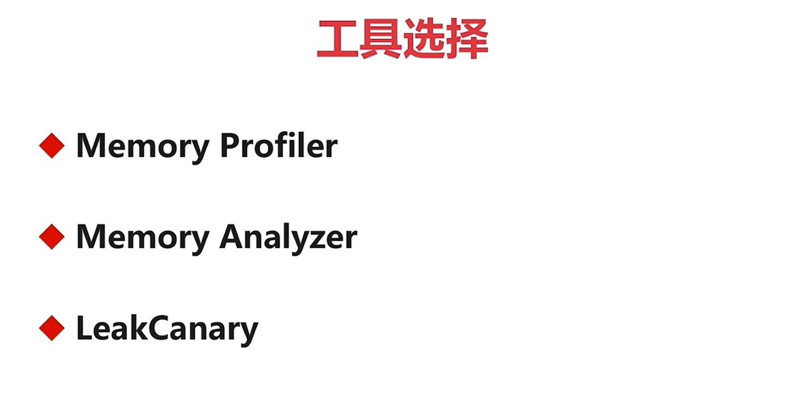

  

---
1.Memory Profiler（4-2，studio自带的工具）------- 可以查内存抖动，可以初步定位内存泄漏：

---
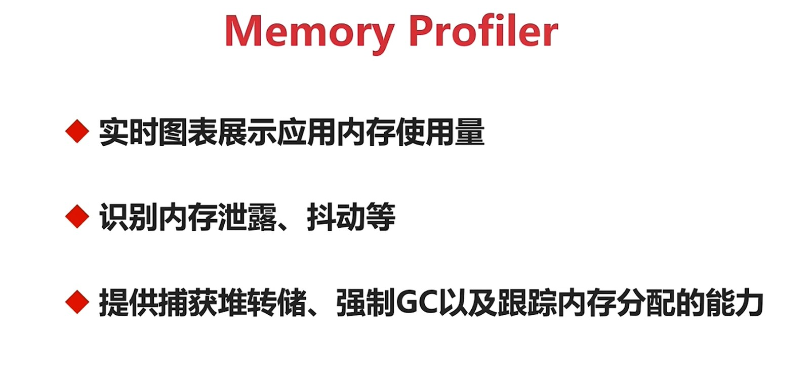

---
2.Memory Analyzer（4-2，结合Memory Profiler一起使用）：

---
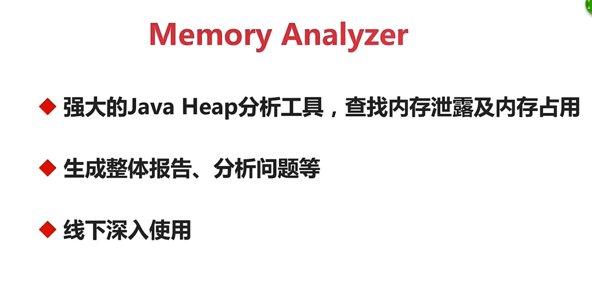

---
3.LeakCanary（4-2，线下使用，如果带到线上可能会对内存造成更大的影响,OOM率会翻倍）：

---
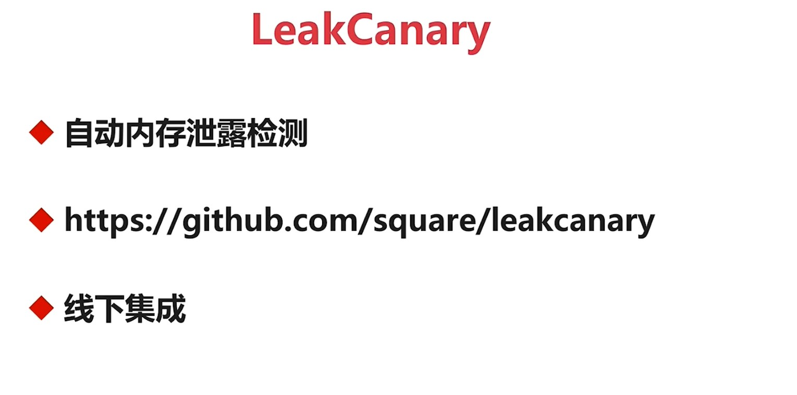

**二.Java内存分配**  

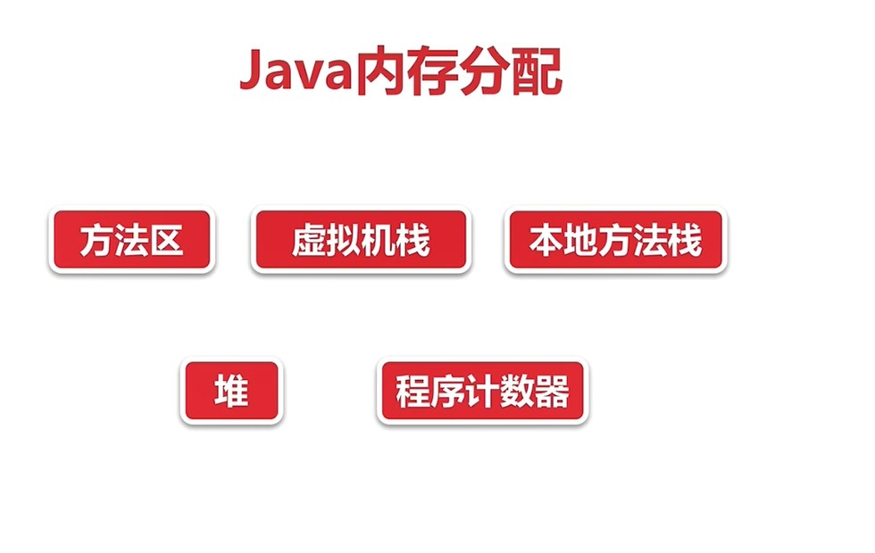

  

    方法区：java的类信息，常量，静态变量等，例如:public,static,final等。方法区是所有线程都共享的

    虚拟机栈：存储局部变量表和操作数栈。

    本地方法栈：为native方法服务的。

    堆：所有线程共享的，实际内存都是在堆上分配的，垃圾回收期GC主要作用的区域，内存泄漏也是发生在这块区域。

    程序计数器：存储当前线程的方法执行到第几行。

**三.Java内存回收算法**  

\*\*\*\*\*\*\*\*1.标记清除算法（容易造成内存空洞）

    \*\*\*\*\*\*\*\*a.标记出所有需要回收的对象  

    b.统一回收所有被标记的对象\*\*\*\*\*\*\*\*

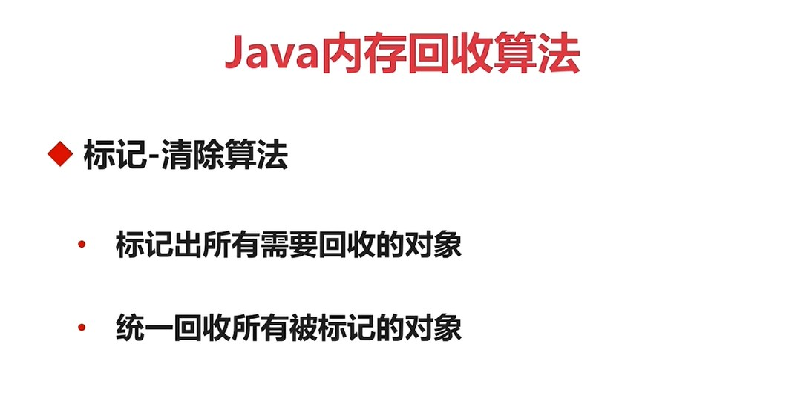

  

示意图：

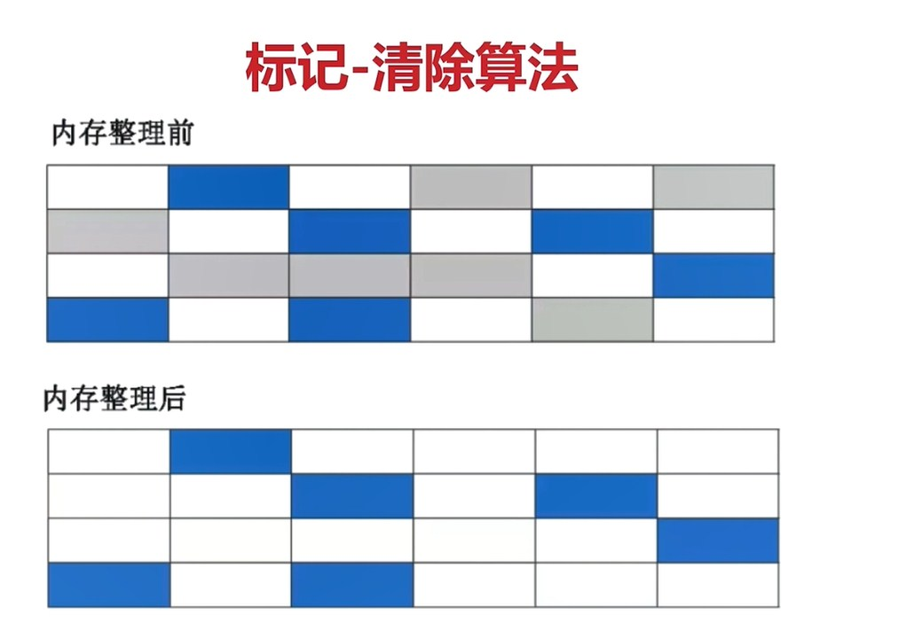

---
特点：

---
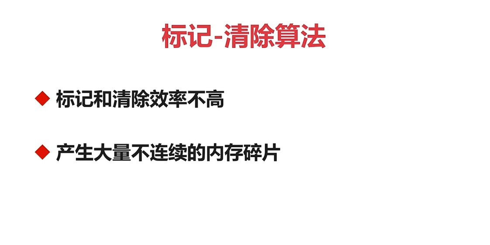

---
2.复制清除算法

    a.将内存划分为大小相等的两块  

    b.一块内存用完之后复制存活对象到另一块  

    c.清理前一块内存

---
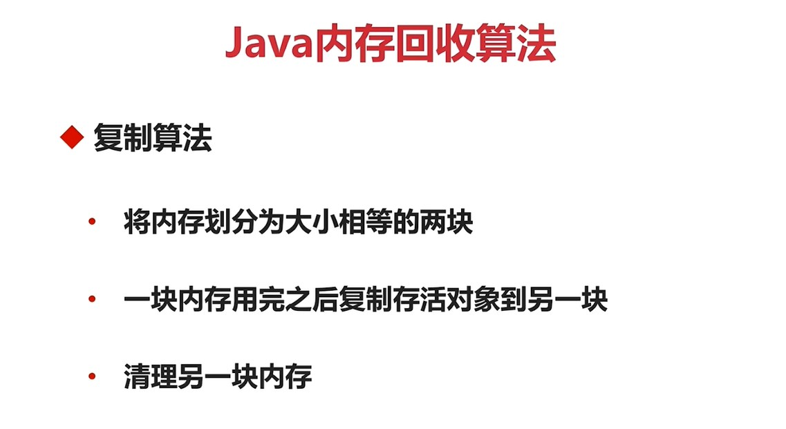

示意图：

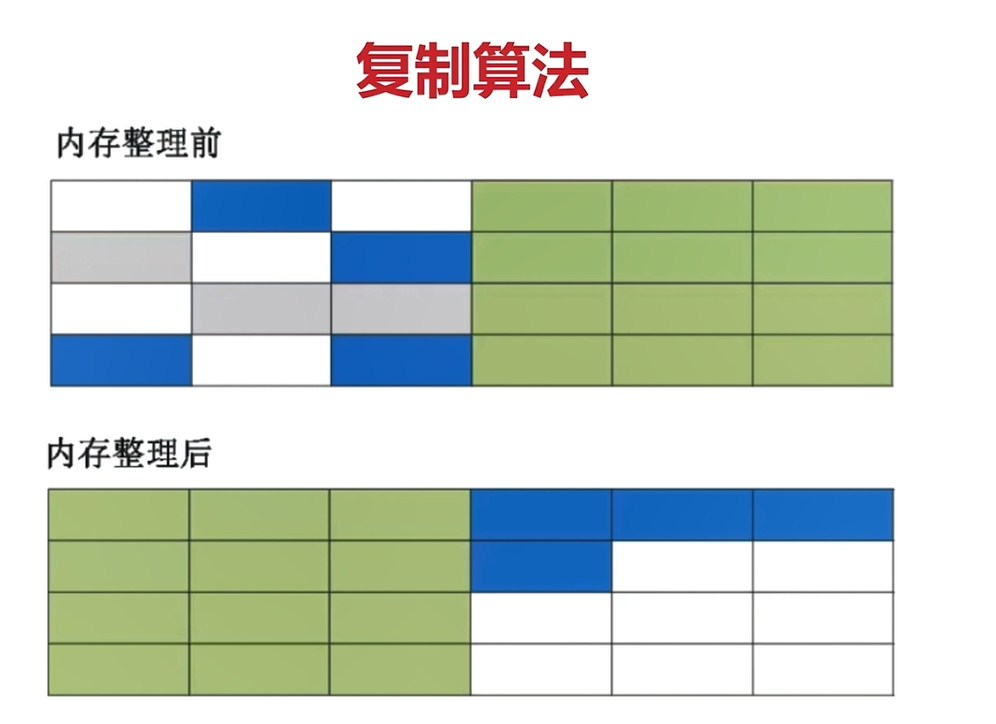

---
特点：

---
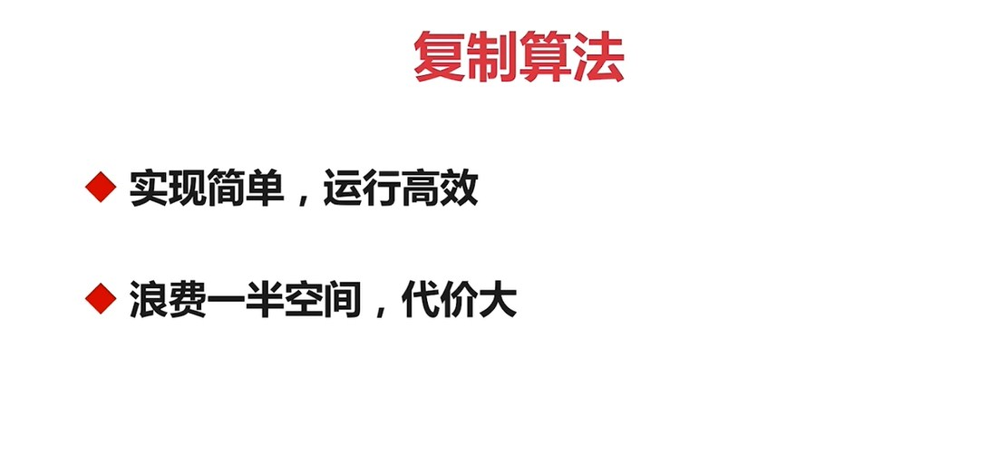

---
3.标记-整理算法

---
    a.标记过程与"标记-清除"算法一样  

    b.存活对象往一端进行移动  

    c.清理剩余内存  

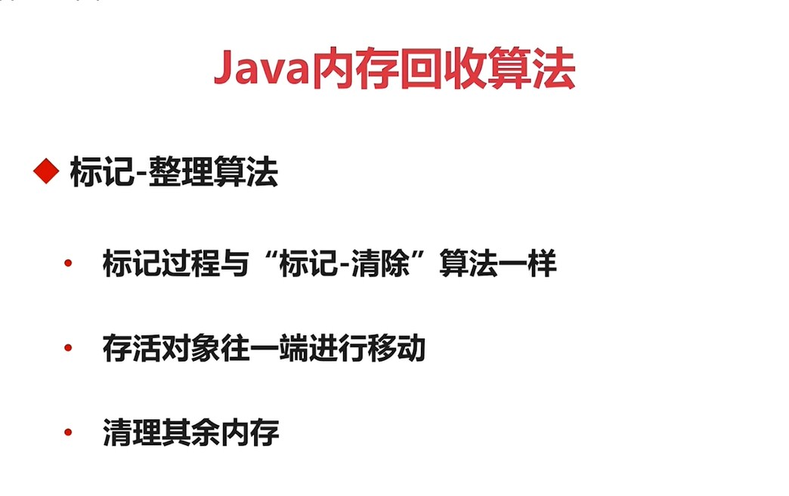

示意图

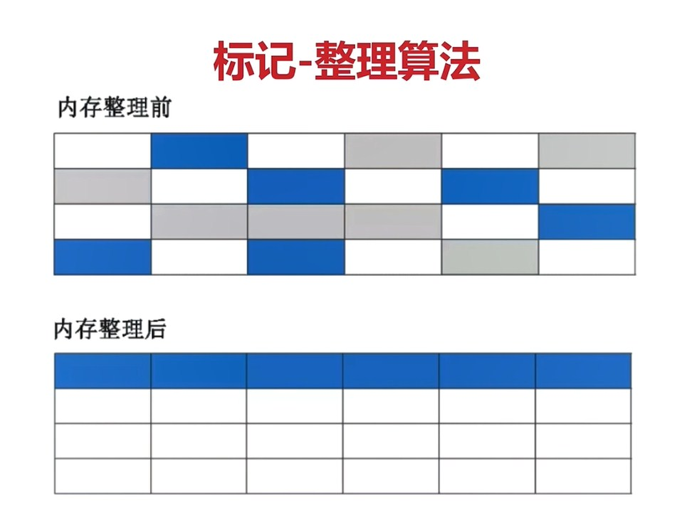

特点：

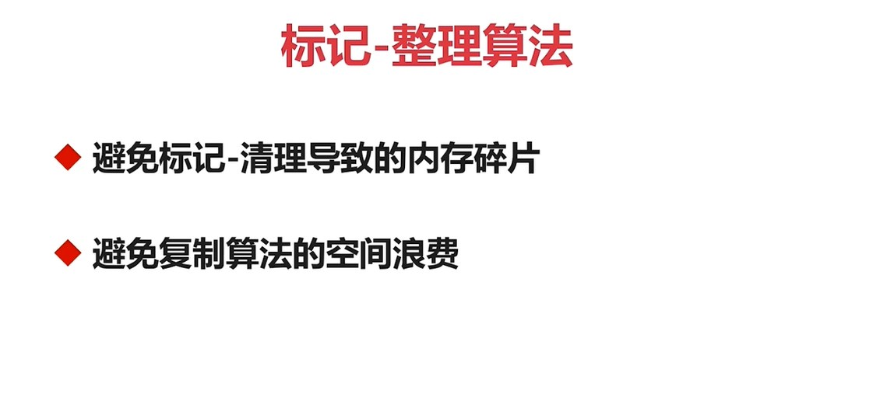

---
4.分代收集算法

    a.结合多种收集算法优势  

    b.新生代对象存活率低，复制算法  

    c.老年代对象存活率高，标记-整理算法  

---
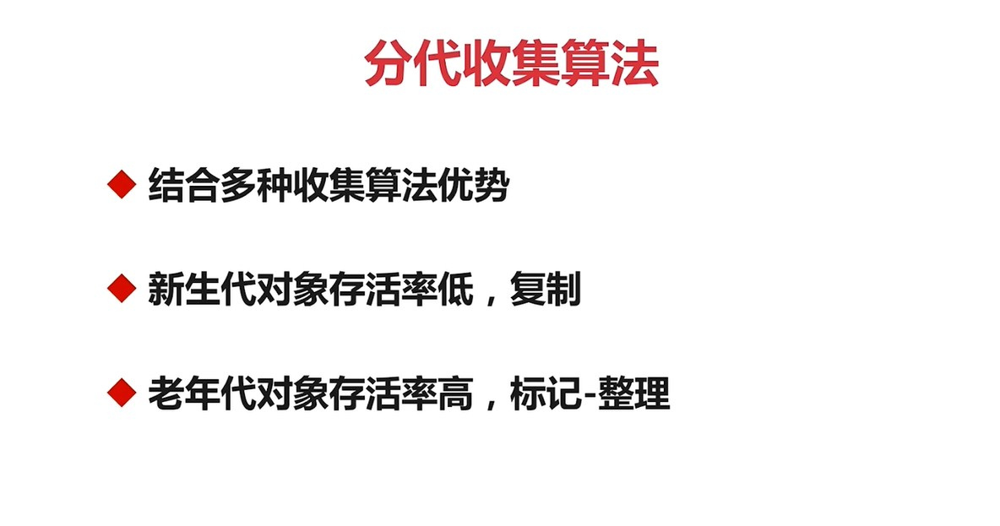

**四.Android内存管理机制**  

    a.内存弹性分配，分配值与最大值受具体设备影响  

    b.OOM场景：内存真正不足、可用内存不足  

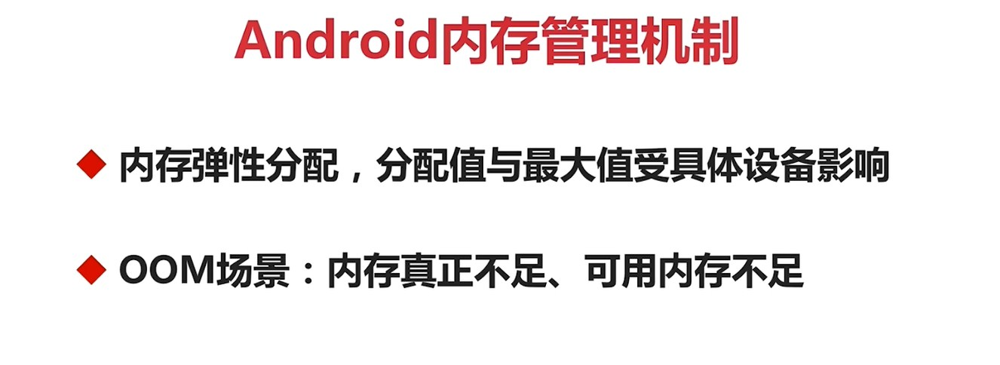

---
1.Dalvik与Art区别

    a.Dalvik仅固定一种回收算法  

    b.Ar回收算法可运行期选择（5.0之后默认使用）  

    c.Art具备内存整理能力，减少内存空洞  

---
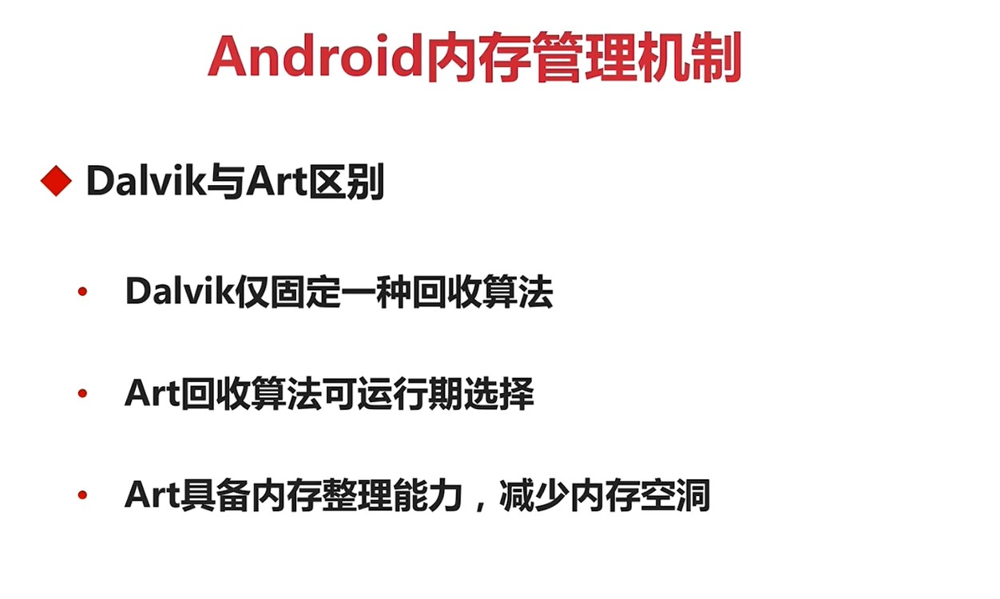

---
2.Low Memory Killer机制（针对所有进程，当手机内存不足的情况下，它就会针对所有进程进行一个回收）

    a.进程分类：前台进程，可见进程，服务进程，后台进程，空进程  

    b.回收收益  

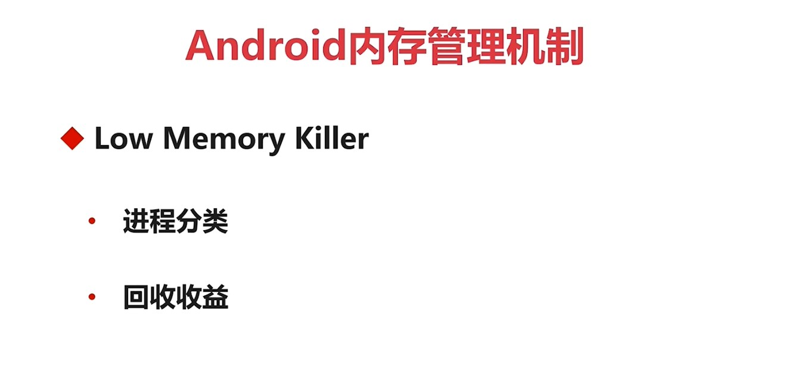

---
**五.内存泄漏介绍及实战**

    **★定义：内存中已经存在没有用的对象**

\*\*\*\*\*\*\*\*       **表现：内存抖动、可用内存逐渐变少**

\*\*\*\*\*\*\*\*\*\*\*\*\*\*\*\*       **危害：内存不足、GC频繁、OOM**\*\*\*\*\*\*\*\*