# android启动优化。
**启动分类**

**App startup time**

**1.冷启动**

**2.热启动**

**3.温启动**


**一.冷启动**

**特点：耗时最多，衡量标准**

 **Click Event -----> IPC -----> Process.start -----> ActivityThread --------> bindApplication ---------> LifeCycle ------> ViewRootImpl**

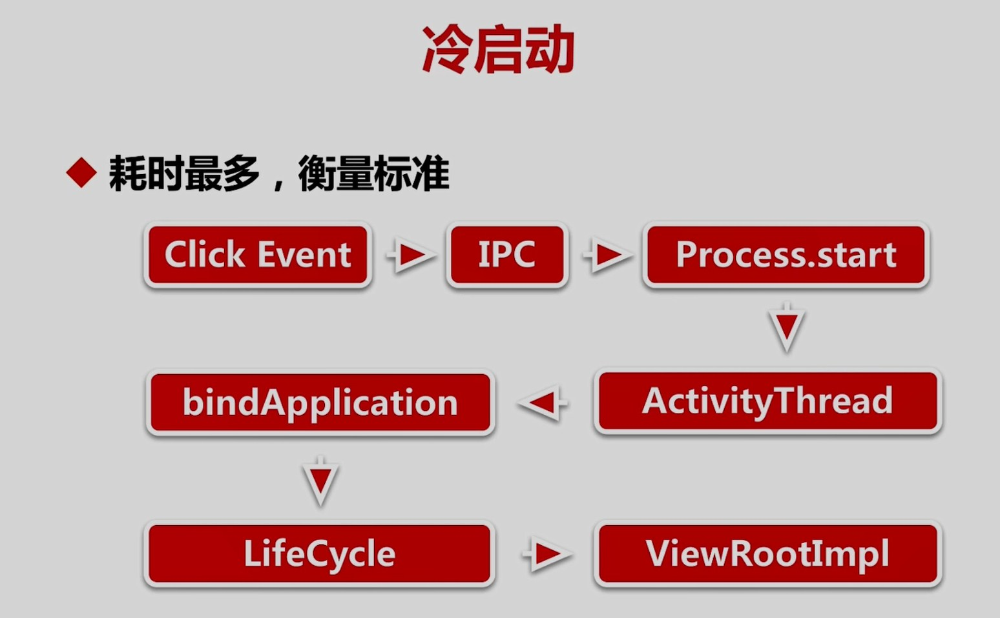


**二.热启动**

**特点：最快**

 **后台 ---------> 前台**

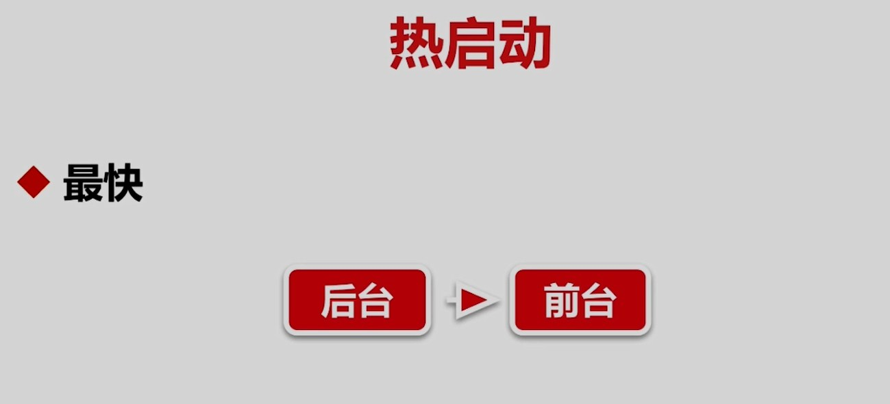


**三.温启动**  

**特点：较快**(介于冷启动和热启动之间的速度)；只会重走Activity生命周期，而不会重走那些进程的创建还有Application的创建以及Application的生命周期等。\*\*\*\*  

 **LifeCycle**

\*\*


**一.启动时间测量方式**  

1.adb命令：

    adb shell am start -W packagename/首屏\*\*

\*\*

packagename.\*\*

activity

\*\*

\*\*

\*\*

特点：

    a.线下使用方便，不能带到线上

    b.非严禁、精确时间  

\*\*\*\*\*\*

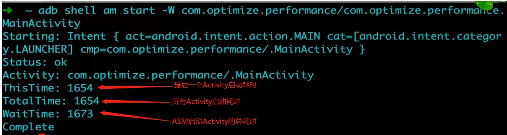


\*\*2.手动打点（推荐使用）：

\*\*

特点：

    a.精确，可带到线上，推荐使用

    b.避开误区，采用feed第一条显示

    c.addOnDrawListener要求API 16

\*\*

             \*\*\*\*\*\*\*\*\*\*\*\*\*\*

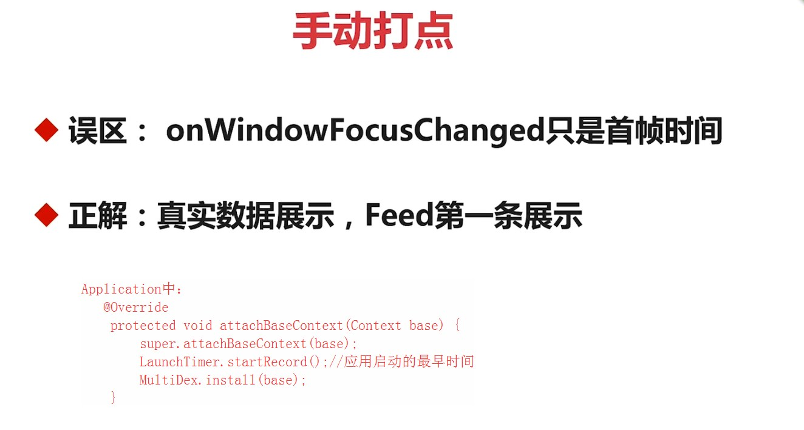

             

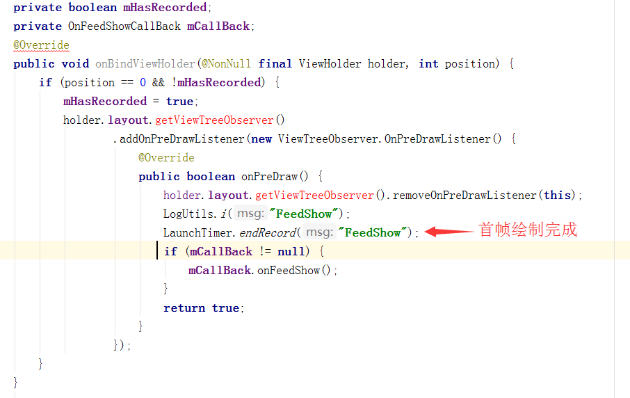

\*\*\*\*\*\*\*\*\*\*\*\*\*\*\*\*\*\*\*\*\*\*\*\*             

```java
    private boolean mHasRecorded;
    private OnFeedShowCallBack mCallBack;
    @Override
    public void onBindViewHolder(@NonNull final ViewHolder holder, int position) {
        if (position == 0 && !mHasRecorded) {
            mHasRecorded = true;
            holder.layout.getViewTreeObserver()
                    .addOnPreDrawListener(new ViewTreeObserver.OnPreDrawListener() {
                        @Override
                        public boolean onPreDraw() {
                            holder.layout.getViewTreeObserver().removeOnPreDrawListener(this);
                            LogUtils.i("FeedShow");
                            LaunchTimer.endRecord("FeedShow");
                            if (mCallBack != null) {
                                mCallBack.onFeedShow();
                            }
                            return true;
                        }
                    });
        }
    }
```
\*\*

\*\*

\*\*

\*\*

\*\*

LaunchTimer代码

\*\*

\*\*

\*\*

\*\*

\*\*

```java
import android.util.Log;

public class LaunchTimer {
    private static long sTime;
    public static void startRecord(){
        sTime = System.currentTimeMillis();
    }

    public static void endRecord(){
        long cost = System.currentTimeMillis() - sTime;
        Log.d("LaunchTimer", "endRecord: " + cost);
    }
}
```
\*\*

**二.启动优化工具选择**

**注意：**

\*\*    **a.两种方式互相补充**    **b.正确认识工具及不同场景选择合适的工具**

---
1.traceview

特点：

\*\*\*\*\*\*\*\*\*\*    \*\*\*\*\*\*\*\*\*\*a.图形的形式展示执行时间、调用栈等

    b.信息全面，包含所有线程  

    c.运行开销严重，整体都会变慢

    d.因为c点可能会带偏优化方向

    e.traceview与cpu profiler，traceview可以更好的埋代码


使用代码：\*\*\*\*\*\*\*\*\*\*

```java
Debug.startMethodTracing("APP");
......
Debug.stopMethodTracing();
```
---
**编译运行APP生成文件，在sd卡：Android/data/packagename/files下**

打开App.strace文件：

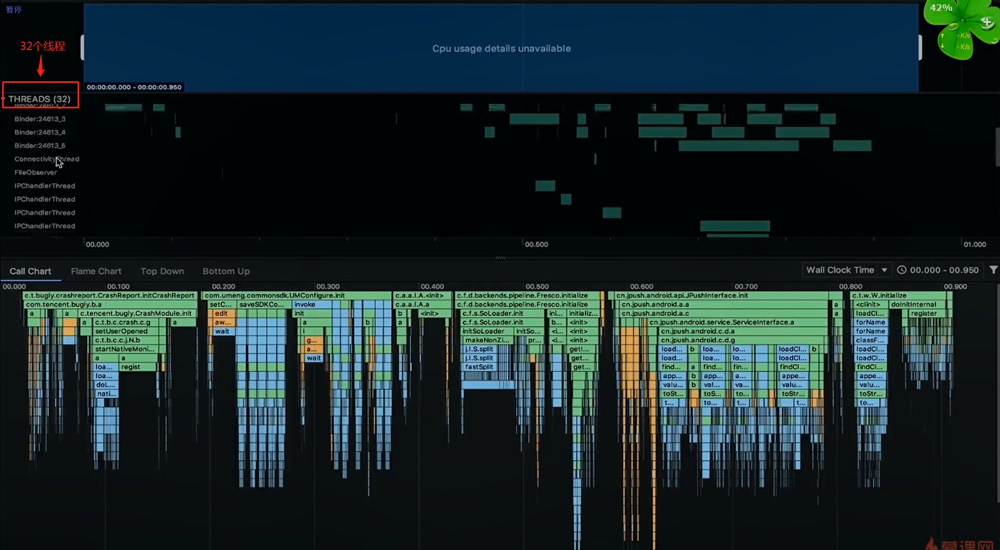


---
Call Chart

---
---
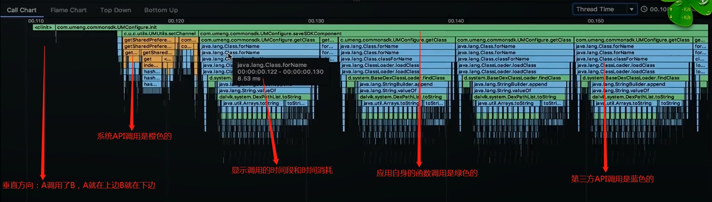

---
---
Flame Chart(火焰图，收集相同的调用顺序)

---
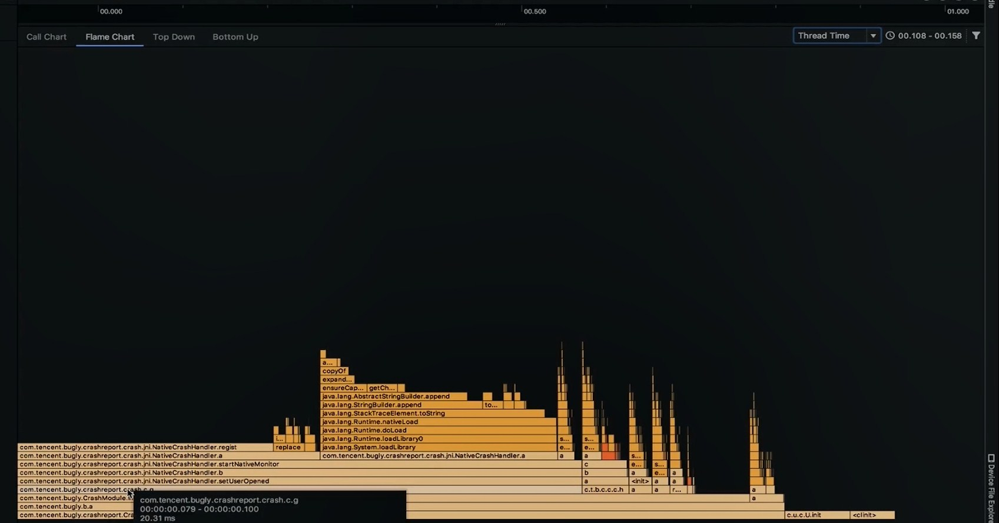


Top Down(wall clock time、thread time)

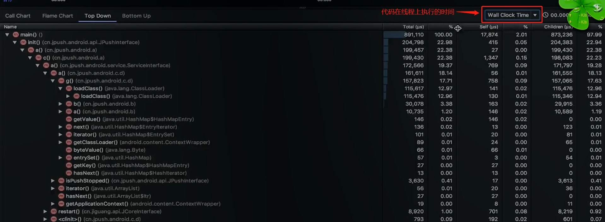

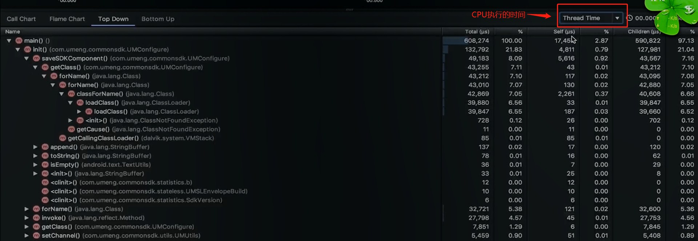

 

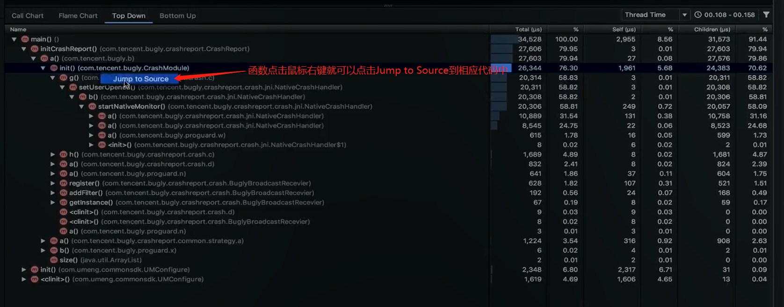

---
Bottom UP(B在上A在下，和Call Chart、Top Down显示效果相反)

---
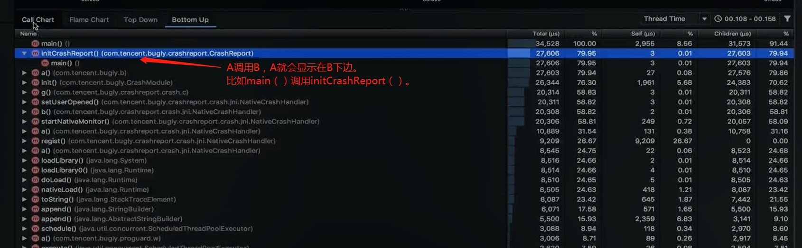


2.systrace

---
特点：

\*\*\*\*\*\*\*\*\*\*   **a.结合Android内核的数据，生成html报告**

   **b.API 18以上使用，推荐TraceCompat（向下兼容）**

    **c.轻量级，开销小**

    **d.直观反应cpu利用率**

    **e.cpu time（**cpu duration**）与wall time（**wall **duration\*\*\*\*）的区别**

        **1.cpu time（cpu duration）是代码消耗cpu的时间（重点指标）**

        **2.wall time（**wall **duration\*\*\*\*）是代码执行时间**

**使用代码：**

```java
TraceCompat.beginSection("AppOnCreate");
......
TraceCompat.endSection();
```
**使用python指令生成文件：**

     \*\*python systrace.py -t 10 \[other-options\] \[categories\]
\*\*

\*\*

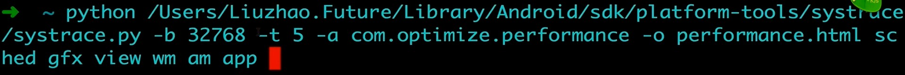


\*\*

**资料网站：****https://developer.android.com/studio/command-line/systrace#command\_options**

**打开生成的html文件：** 

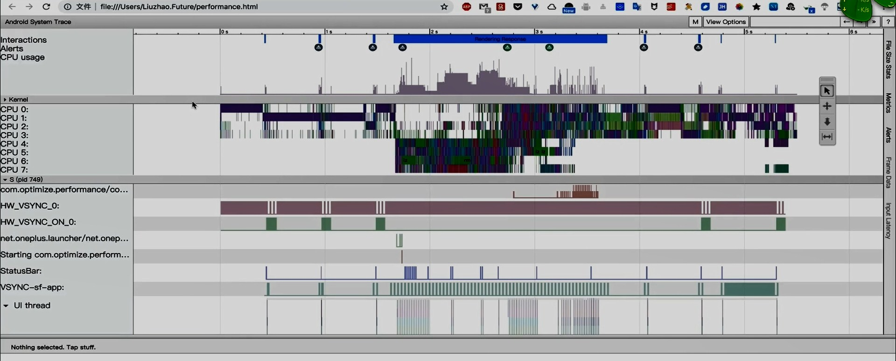


\*\*

**三.优雅获取方法耗时**

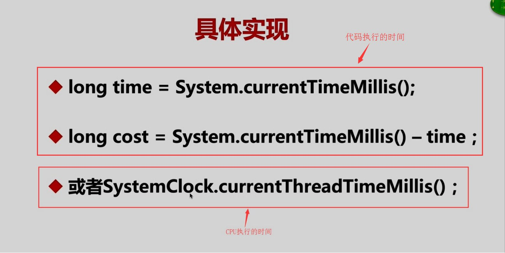


1.常规实现（不推荐这种做，代码过多重复，会导致强耦合）：

---
特点：

\*\*\*\*\*\*\*\*\*\*   **a.侵入性强**

   **b.工作量大**


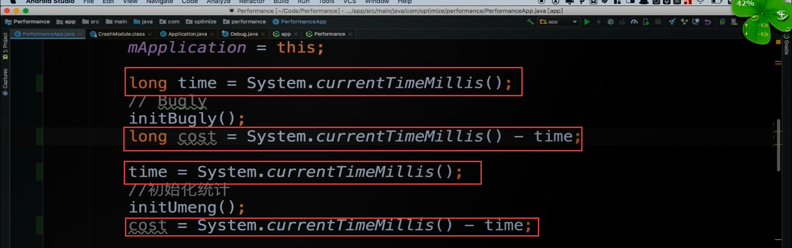


---
2.AOP（Aspect Oriented Programming）：

---
特点：

\*\*\*\*\*\*\*\*\*\*\*\*   **a.面向切面编程**

   **b.针对同一类问题的统一处理**

\*\*    **c.无侵入添加代码**    \*\***d.修改方便**


**1.Join Points（程序运行时的执行点，可以作为切面的地方）\*\***    **a.函数调用、执行**    **b.获取、设置变量（get、set方法）**    \*\***c.类初始化**

**2.PointCut**   

    **带条件的Join Points**


**3.Advice(一种Hook，要插入代码的位置)**

    **a.Before：PointCut之前执行\*\***    **b.After：PointCut之后执行**    \*\***c.Around：PointCut之前、之后分别执行**

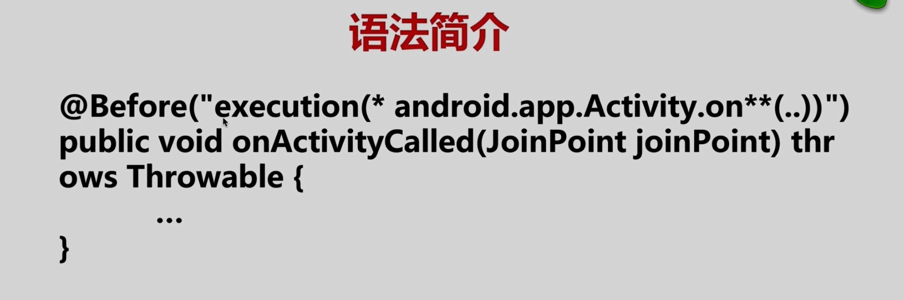

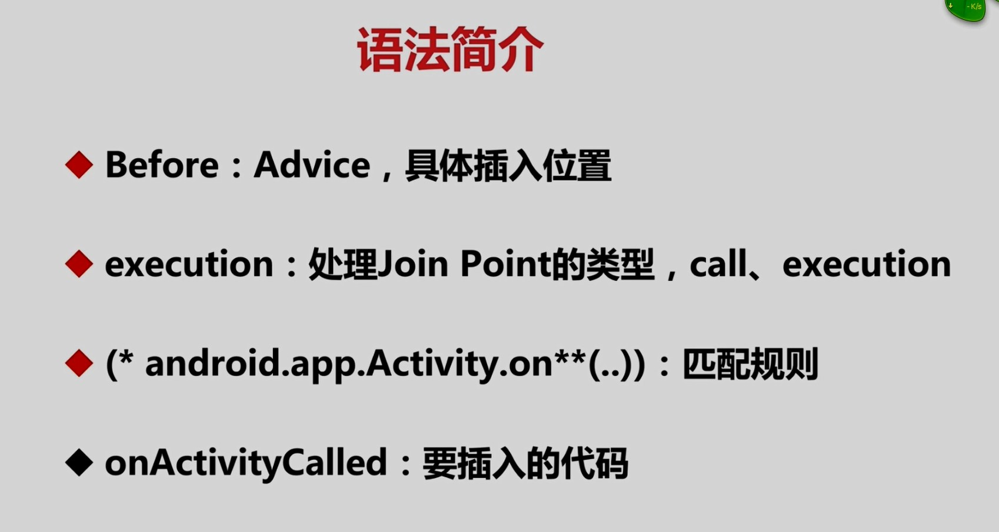


\*\*

AspectJ使用（3-7）

    classpath 'com.hujiang.aspectjx:gradle-android-plugin-aspectjx:2.0.0'

    implementation 'org.aspect:aspectjrt:1.8.+'

    apply plugin:'android-aspectjx'

\*\*  

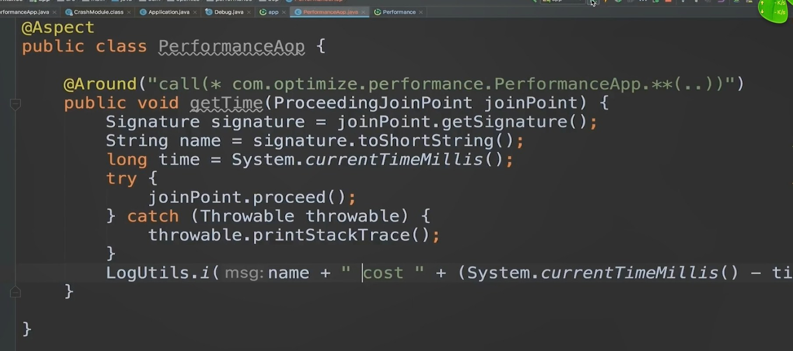


\*\*

**四.异步优化**

1.优化小技巧，Theme切换（感观上的快）（3-8）：

    ①：drawable下创建一个layer.xml：

---
```java
<?xml version="1.0" encoding="utf-8"?>
<layer-list xmlns:android="http://schemas.android.com/apk/res/android">
    <!-- 背景颜色 -->
    <item android:drawable="@android:color/white"/>

    <!-- 图片 如果尺寸不一致，那么周围的填充色就是背景色-->
    <item>
        <bitmap android:src="@drawable/start_page"
            android:gravity="fill"/>  <!-- clip_horizontal -->
    </item>
</layer-list>
```
        **②.①：在values-styles.xml:**

```java
<resources>
    <!--方法1： 图片不是全屏 -->
    <style name="AppTheme.Launcher" parent="Theme.AppCompat.Light.DarkActionBar">
        <item name="android:windowBackground">@drawable/layer</item>
        <item name="windowActionBar">false</item>
        <item name="android:windowNoTitle">true</item>
        <item name="windowNoTitle">true</item>
    </style>

    <!--方法2： 图片是全屏 -->
    <style name="AppTheme.Launcher" parent="@android:style/Theme.NoTitleBar.Fullscreen">
        <item name="android:windowBackground">@drawable/layer</item>
        <item name="windowActionBar">false</item>
        <item name="android:windowNoTitle">true</item>
        <item name="windowNoTitle">true</item>
    </style>

     <!--方法3： 图片是全屏 -->
    <style name="AppTheme.Launcher" parent="Theme.AppCompat.Light.NoActionBar">
        <item name="android:windowBackground">@drawable/layer</item>
        <item name="android:windowFullscreen">true</item>
    </style>
</resources>
```
       \*\*\*\*\*\*\*\***②.②：**

\*\*

\*\*

在清单文件的activity中配置：

\*\*

\*\*

---
        **③.①：在values-styles.xml:**

```java
<resources>
    <!-- 无ActionBar -->
    <style name="noBar" parent="Theme.AppCompat.Light.NoActionBar">
        <!-- Customize your theme here. -->
        <item name="colorPrimary">@color/colorPrimary</item>
        <item name="colorPrimaryDark">@color/colorPrimaryDark</item>
        <item name="colorAccent">@color/colorAccent</item>
    </style>
</resources>
```
        **③.②：在Acitivity的Oncreate中：**

```java
    @Override
    protected void onCreate(Bundle savedInstanceState) {
        setTheme(R.style.noBar);//在super前,好像不写也没问题。
        super.onCreate(savedInstanceState);
    }
```
\*\*

\*\*


\*\*

\*\*

2.常规异步优化（不推荐）（CountDownLatch、ExecutorService）（3-8）：

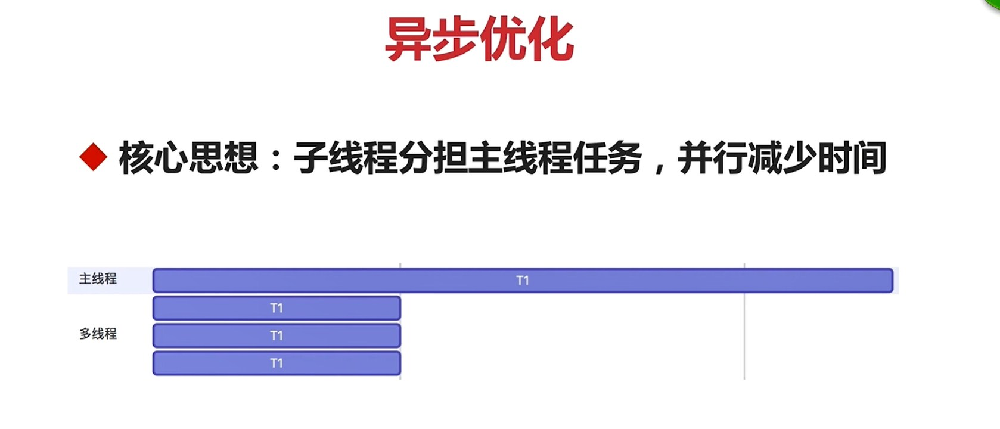

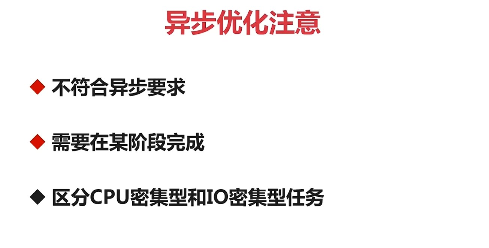

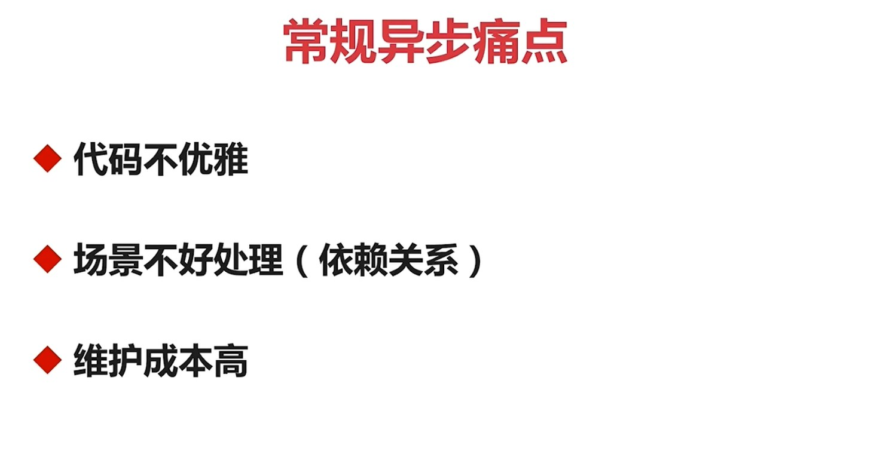

\*\*

\*\*  


\*\*

---
\*\*

\*\*

\*\*

\*\*

使用代码（CountDownLatch、ExecutorService）

\*\*

\*\*

\*\*

\*\*

---
\*\*

```java
    private CountDownLatch mCountDownLatch = new CountDownLatch(1);//传入1表示CountDownLatch必须被满足1次,即调用countDown()方法一次。

    //系统AsyncTask中设置线程池数量
    private static final int CPU_COUNT = Runtime.getRuntime().availableProcessors();  //获得设备CPU数量
    // We want at least 2 threads and at most 4 threads in the core pool,
    // preferring to have 1 less than the CPU count to avoid saturating
    // the CPU with background work
    private static final int CORE_POOL_SIZE = Math.max(2, Math.min(CPU_COUNT - 1, 4)); 

    @Override
    public void onCreate() {
        super.onCreate();

        ExecutorService executorService = Executors.newFixedThreadPool(CORE_POOL_SIZE);
        executorService.submit(new Runnable() {
            @Override
            public void run() {
                //初始化腾讯Bug上传
                initTetentBugly();  

                mCountDownLatch.countDown();//CountDownLatch满足一次

            }
        });

        try {
            mCountDownLatch.await();//如果CountDownLatch没有被满足，就一直等待。
        } catch (InterruptedException e) {
            e.printStackTrace();
        }
    }
```
---
3.异步优化最优解（启动器）（3-9、3-10）：

核心思想：充分利用CPU多核，自动梳理任务顺序。


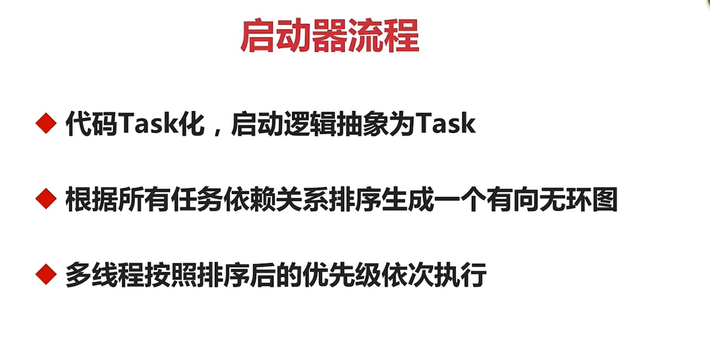


---
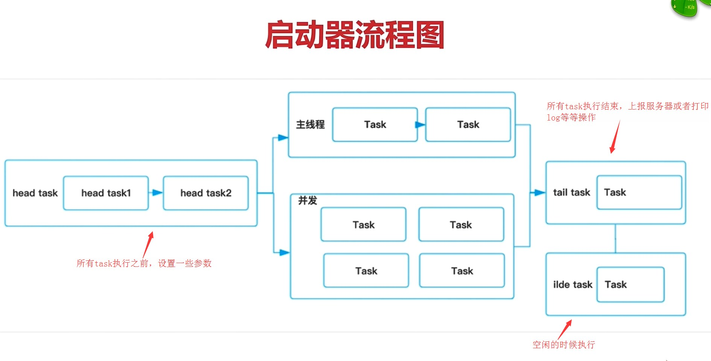


**使用代码：**  

    **①：主线程执行的Task**

```java
/*
*  主线程执行的task
*/
public class InitUmengTask extends MainTask {
    @Override
    public void run() {
        UMConfigure.setLogEnabled(true);
        MobclickAgent.setCatchUncaughtExceptions(false);
        UMConfigure.init(mContext, "5b518009a40fa327a300004d", "Umeng",
                UMConfigure.DEVICE_TYPE_PHONE, "");
        //设置普通Dplus使用场景：
        MobclickAgent.setScenarioType(mContext, MobclickAgent.EScenarioType.E_DUM_NORMAL);
        //Umeng分享
        PlatformConfig.setWeixin("wx29c324f040ddc692", "015fb7cd7da1cb5de7f53a1f75a4932c");
        PlatformConfig.setQQZone("101437145", "f41155986a2f85d0cad9b426e7202ecf");
    }
}
```
    **②.①：异步执行的task**

```java
/*
 *  异步执行的task
 */
public class InitCrashHandlerTask extends Task {
    @Override
    public void run() {
        CrashHandler.getInstance().init(mContext);
    }
}
```
    **②.②：需要被等待的异步Task**

```java
 /*
 *  异步执行的task
 */
public class InitXingeTask extends Task {

    /*
    * 重写等待方法，使这个异步task执行完之后再执行其他task
    */
    @Override
    public boolean needWait() {
        return true;
    }

    @Override
    public void run() {
        XGPushConfig.enableDebug(mContext, true);
        XGPushManager.registerPush(mContext, new XGIOperateCallback() {
            @Override
            public void onSuccess(Object data, int flag) {
                //token在设备卸载重装的时候有可能会变
                Log.e("TPush", "注册成功，设备token为：" + data);
            }

            @Override
            public void onFail(Object data, int errCode, String msg) {
                Log.e("TPush", "注册失败，错误码：" + errCode + ",错误信息：" + msg);
            }
        });
    }
}
```
      **②.**

---
\*\*

\*\*

③

\*\*

\*\*

---
**：有依赖关系的异步Task**

```java
/*
 *  异步执行的task
 */
public class InitBaiduLocationTask extends Task{

    /*
    *  重写依赖关系方法，添加依赖的类，依赖的类执行完毕之后再执行这个类。
    */
    @Override
    public List<Class<? extends Task>> dependsOn() {
        List<Class<? extends Task>> task = new ArrayList<>();
        task.add(InitCrashHandlerTask.class);
        return task;
    }

    @Override
    public void run() {
        /***
         * 初始化定位sdk，建议在Application中创建
         */
        LocationService locationService = new LocationService(mContext);
        //震动传感器
        Vibrator mVibrator = (Vibrator) mContext.getSystemService(Service.VIBRATOR_SERVICE);
        SDKInitializer.initialize(mContext);
    }
}
```
    **③：调用启动器:**

```java
TaskDispatcher.init(getApplicationContext());
        TaskDispatcher instance = TaskDispatcher.createInstance();
        instance.addTask(new InitXingeTask())
                .addTask(new InitCrashHandlerTask())
                .addTask(new InitBaiduLocationTask())
                .addTask(new InitUmengTask())
                .start();
        instance.await();//使needWait()生效;
```
---
\*\*

\*\*

**五.更优秀的延迟初始化方案**

\*\*

\*\*

1.常规方案（3-11）：

---
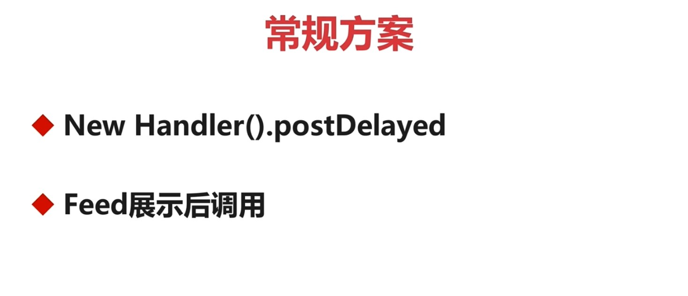


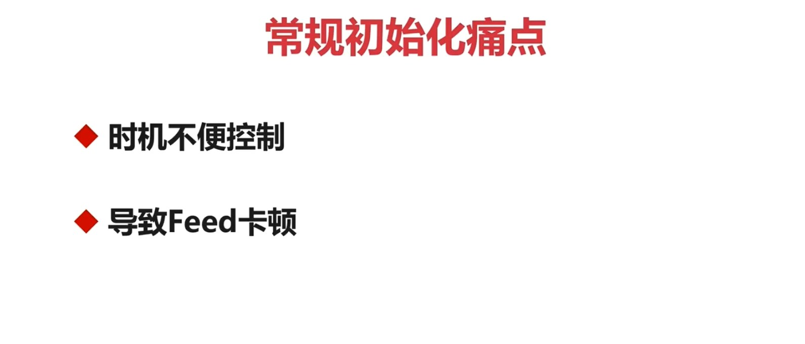

---
2.更优方案（3-11）：

---


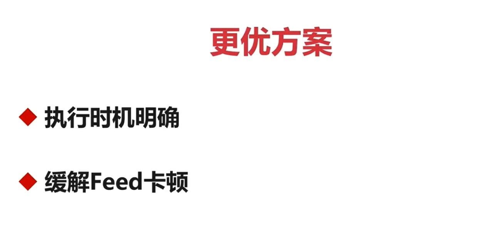

```java
import android.os.Looper;
import android.os.MessageQueue;


import com.fsh.lfmf.launchstarter.task.DispatchRunnable;
import com.fsh.lfmf.launchstarter.task.Task;

import java.util.LinkedList;
import java.util.Queue;

public class DelayInitDispatcher {

    private Queue<Task> mDelayTasks = new LinkedList<>();

    private MessageQueue.IdleHandler mIdleHandler = new MessageQueue.IdleHandler() {
        @Override
        public boolean queueIdle() {
            if(mDelayTasks.size()>0){
                Task task = mDelayTasks.poll();
                new DispatchRunnable(task).run();
            }
            return !mDelayTasks.isEmpty();
        }
    };

    public DelayInitDispatcher addTask(Task task){
        mDelayTasks.add(task);
        return this;
    }

    public void start(){
        Looper.myQueue().addIdleHandler(mIdleHandler);
    }

}
```
---
---
**五.优化总方针**


  

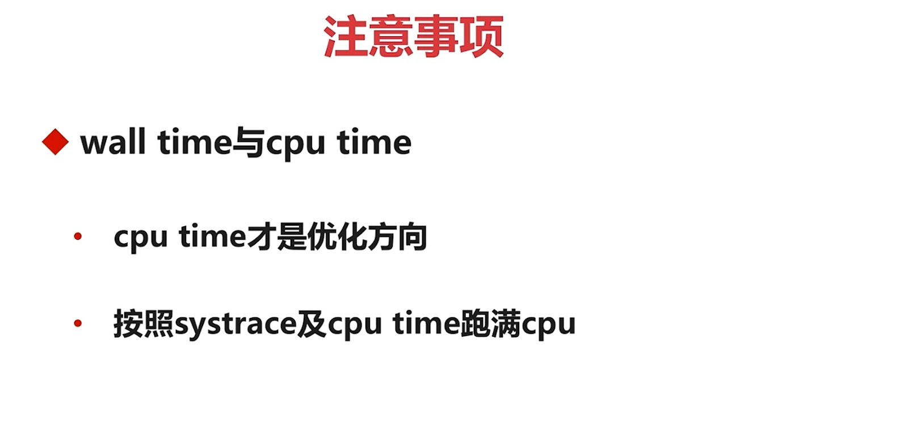


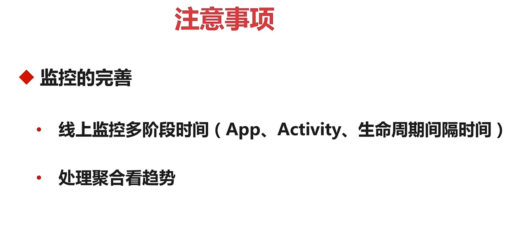

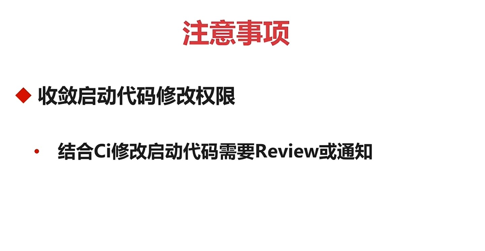


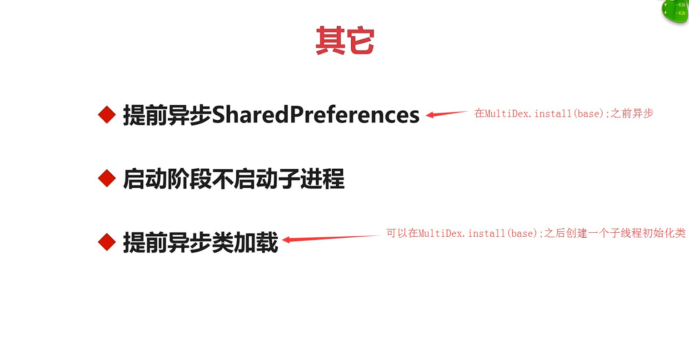

  

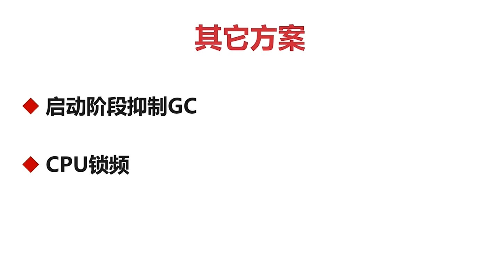


\*\*\*\*\*\*\*\*\*\*\*\*1.懒加载（3-12）：

用到的时候初始化，不用到的时候不初始化，例如：某个页面需要用到高德地图，当用户在这个页面用到高德地图的时候进行初始化，在其他地方用不到的时候不进行初始化。


---
---
2.提前加载SharedPreferences（3-12）：

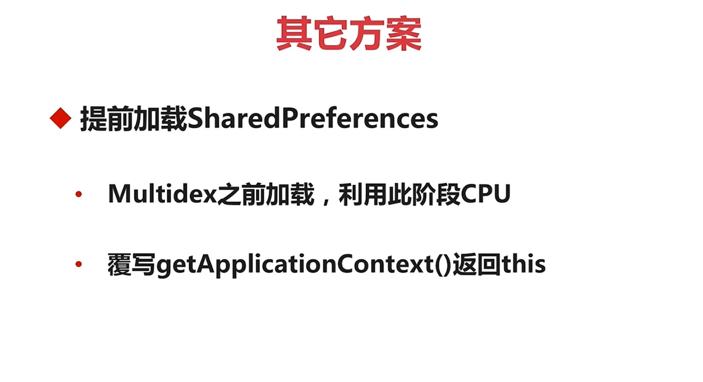


---
3.自动阶段不启动子进程（3-12）：

---
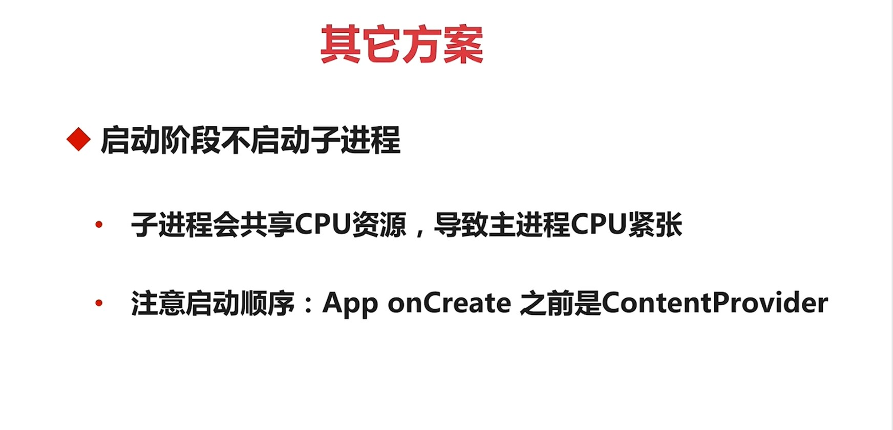

---
4.提前类加载（3-12）：

---
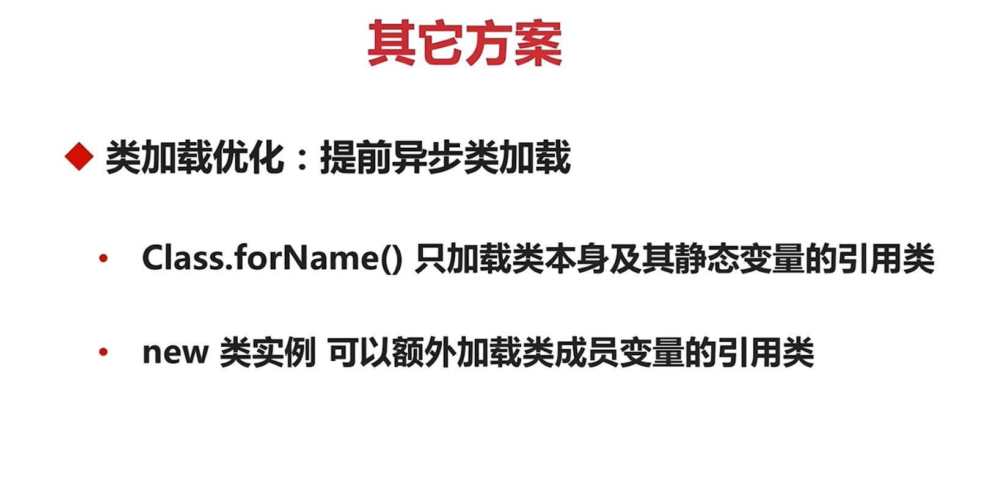


---