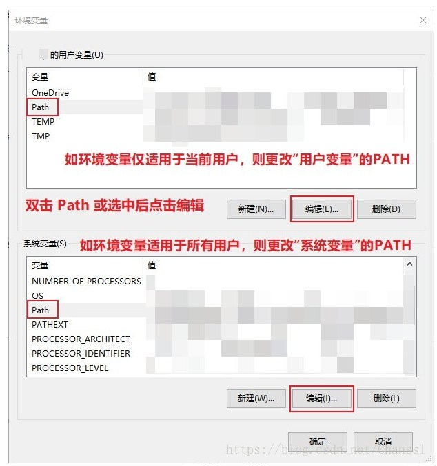

# FFMPEG环境配置准备
FFMPEG准备  

[https://www.jianshu.com/p/c612d53fea90](https://www.jianshu.com/p/c612d53fea90)

### 安装方法1(推荐使用)：
Windows 10 安装 FFmpeg 并设置环境变量

下载 FFmpeg

下载地址： [https://ffmpeg.zeranoe.com/builds/](https://ffmpeg.zeranoe.com/builds/)

    下载 Shared 动态编译版本亦可，且体积较小。  

    


解压放置

1.将下载的压缩包解压获得 ffmpeg-4.0.2-win64-static 文件夹，将其重命名为 ffmpeg

2.将 ffmpeg 文件夹放置到程序文件夹，假设放置路径为：D:\\Program Files

3.打开环境变量设置页：资源管理器 > 此电脑 > 右键-属性 > 高级系统设置 > 环境变量

4.双击 Path 项进入编辑页

5.选择新建，将 路径D:\\Program Files\\ffmpeg\\bin 粘贴至输入框后确定保存。

亦可选择浏览，选中 ffmpeg 目录下的 bin 目录 后确定保存




测试使用

打开命令行的窗口（CMD），输入 ffmpeg 回车执行，有回显如下信息，即设置成功。

如未有，请检查你在第二步中的操作。


### 安装方法2（慕课网）
> 在window上安装ffmpeg最好的方式是安装Cygwin，相当于是在windows上安装一个虚拟机。
参考资料：
[https://www.imooc.com/article/247113](https://www.imooc.com/article/247113)
[http://www.cnblogs.com/feipeng8848/p/8555648.html](http://www.cnblogs.com/feipeng8848/p/8555648.html)
[https://blog.csdn.net/Wu\_qz/article/details/80807517](https://blog.csdn.net/Wu_qz/article/details/80807517)

* 在**windos**上安装ffmpeg:  
* 到 [Cygwin](https://cygwin.com/install.html)官网下载 Cygwin 的可执行程序 [setup-x86\_64.exe](https://cygwin.com/setup-x86_64.exe)。当然，它是 64位的，如果你现在还在用 32位的，那请在 Cygwin官网上找 32位对应的版本。
* 安装Cygwin\* 安装完**Cynwin**后，如果再要下载别的东西可能会比较麻烦，可以用**apt-cyg**解决：

> ①在Cygwin下执行下面的命令:
wget -c [https://raw.githubusercontent.com/transcode-open/apt-cyg/master/apt-cyg](https://raw.githubusercontent.com/transcode-open/apt-cyg/master/apt-cyg)
②执行：
install apt-cyg /bin

> **测试cygwin是否安装成功：**
运行cygwin，在弹出的命令行窗口输入：cygcheck -c cygwin命令，会打印出当前cygwin的版本和运行状态，如果status是ok的话，则cygwin运行正常。然后依次输入gcc –version，g++ --version，make –version，gdb –version进行测试，如果都打印出版本信息和一些描述信息，非常高兴的告诉你，你的cygwin安装完成了

**要装某个包就可以用 apt-cyg instal xxx这样来安装了。**

* 编译 yasm

```Plain Text
wget http://www.tortall.net/projects/yasm/releases/yasm-1.3.0.tar.gz
tar zxvf yasm-1.3.0.tar.gz
cd yasm-1.3.0
./configure
make && sudo make install

```
> 问题：-bash: make: 未找到命令
解决：不用重新安装cynwin。
①在[http://ftp.gnu.org/gnu/make/](http://ftp.gnu.org/gnu/make/)网站上下载最新的make压缩包,xxx.tar.gz;
②解压后用cygwin命令进入根目录(cd 目录)后执行如下命令:
./configure
./build.sh
当前目录生成make.exe文件
放入cygwin安装目录的bin文件夹下

> 问题：-bash: sudo: 未找到命令:
不用sudo了

* 编译 fdk-aac

```Plain Text
wget https://jaist.dl.sourceforge.net/project/opencore-amr/fdk-aac/fdk-aac-0.1.6.tar.gz
tar xvf fdk-aac-0.1.6.tar.gz
cd fdk-aac-0.1.6
./configure
make && sudo make install

```
* 安装lame

```Plain Text
wget http://downloads.sourceforge.net/project/lame/lame/3.99/lame-3.99.5.tar.gz
tar -xzf lame-3.99.5.tar.gz
cd lame-3.99.5
./configure
make && sudo make install

```
> 问题1：
在Cygwin下安装 lame的时候遇到执行 ./configure 失败的情况。如 "error: cannot guess build type; you must sepcify one"，对这个问题可以通过下面的步骤来解决：
1.安装automake。可以通过 which automake来确认automake 是否已经安装。如果没有安装，可以通使用 apt-cyg install automake进行安装。
2.确认automake当前版本。可执行automake --version获取当前automake的版本号。
3.将 lame目录下的 config.guess文件替换为 /usr/share/automake-version下的config.guess 文件。
4.此时，再执行./configure进就可以下成功了。


> 查找automake版本.png


> automake路径.png

> 问题二：
make时出现 "error: '\_O\_BINARY' undeclared (first use in this function)"的错误，解决办法如下：
1.打开出错文件 vi ./frontend/lametime.c (C:\\Users\\Administrator\\lame-3.99.5\\frontend\\lametime.c)
将下面这段代码注释掉
/\*#elif defined \_\_CYGWIN
setmod(fileno(fp), \_O\_BINARY);
\*/
再执行make就可以成功了。

* 安装nasm

```Plain Text
wget https://www.nasm.us/pub/nasm/releasebuilds/2.13.03/nasm-2.13.03.tar.gz
tar xvf nasm-2.13.03.tar.gz
cd nasm-2.13.03
./configure
make && sudo make install

```
* 安装x264

```Plain Text
wget http://mirror.yandex.ru/mirrors/ftp.videolan.org/x264/snapshots/last_x264.tar.bz2
bunzip2 last_x264.tar.bz2
tar -vxf last_x264.tar
cd last_x264
./configure --enable-static --enable-shared --disable-asm --disable-avs
make && sudo make install

```
* 安装ffmpeg
从ffmpeg官网下载代码编译, 编译方法如下：

```Plain Text
wget -c https://ffmpeg.org/releases/ffmpeg-4.0.2.tar.bz2
bunzip2 ffmpeg-4.0.2.tar.bz2
tar -vxf ffmpeg-4.0.2.tar
cd ffmpeg-4.0.2
./configure --prefix=/usr/local/ffmpeg --enable-gpl --enable-small --arch=x86_64 --enable-nonfree --enable-libfdk-aac --enable-libx264 --enable-filter=delogo --enable-debug --disable-optimizations --enable-shared
make && make install

```
> 问题1：安装ffmpeg的时候会出错：找不到 fdk-aac库
解决方案：[https://ffmpeg.zeranoe.com/builds/](https://ffmpeg.zeranoe.com/builds/) 从这个地址下载windows版的ffmpeg，下载解压后，执行`./configure`，然后再执行`make && make install`
问题2：windows启动ffmpeg时提示计算机中丢失cygwin1.dll：
1、如果您的系统提示"找不到cygwin1.dll"或"cygwin1.dll缺失" 或者"cygwin1.dll错误"等等，请不用担心，请把cygwin1.dll下载到本机。
2、直接拷贝该文件到系统目录里：
　　 ①、Windows 95/98/Me系统，将cygwin1.dll复制到C:WindowsSystem目录下。
　　 ②、Windows NT/2000系统，将cygwin1.dll复制到C:WINNTSystem32目录下。
　　 ③、Windows XP/WIN7系统，将cygwin1.dll复制到C:WindowsSystem32目录下。
3、开始-运行-输入regsvr32 cygwin1.dll 回车即可解决错误提示
问题3：解决了问题2之后，可能还是打不开ffmpeg。

> 说明：
make 是编译，这一步不需要 sudo ，仅仅make就可以了
make install 这个是将编译后的文件安装到系统，需要root权限所以需要使用 sudo 来完成。


测试是否安装成功.png