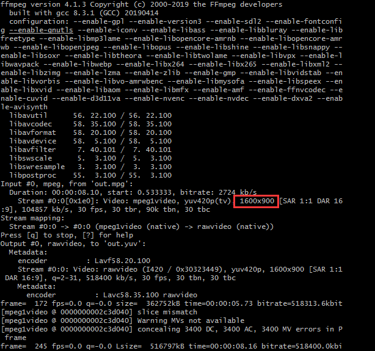
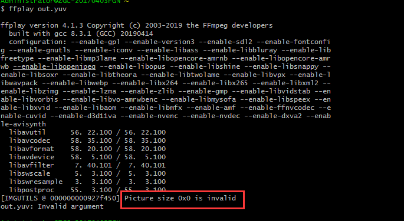
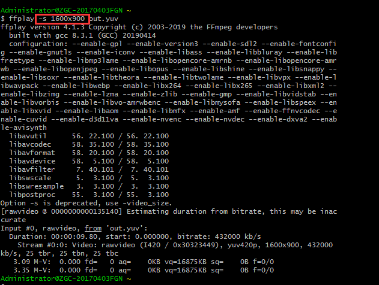
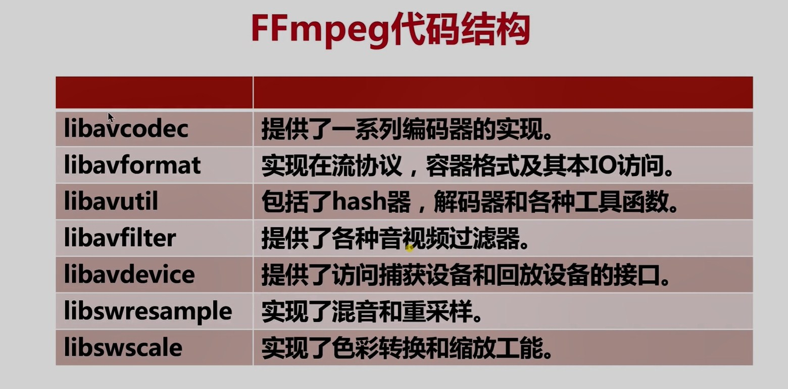
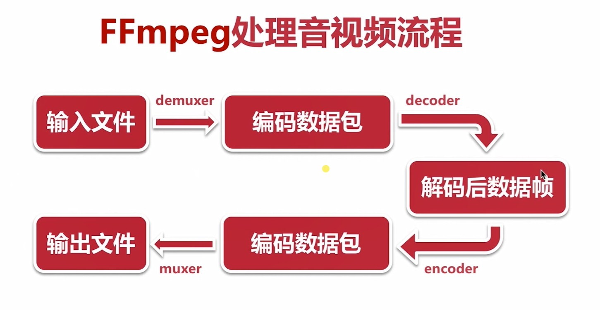
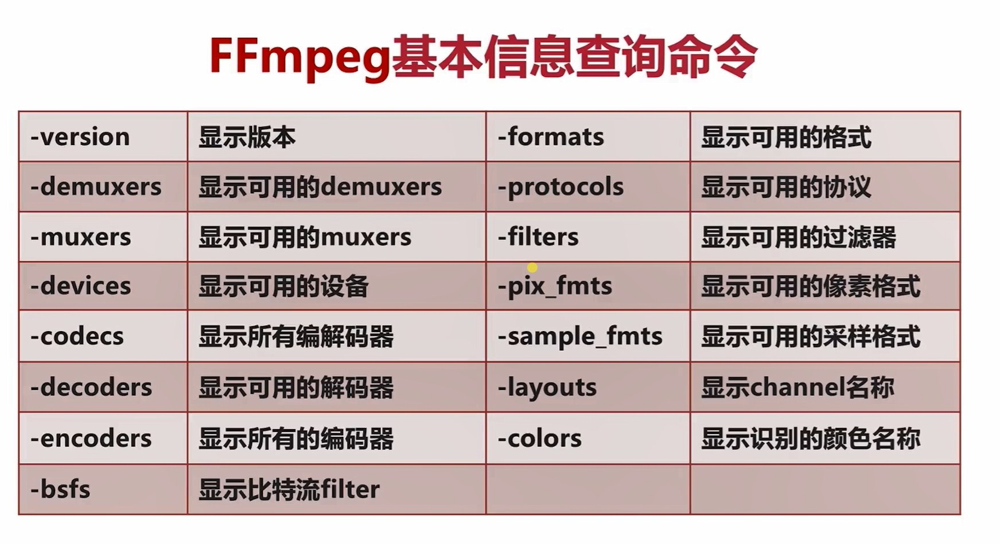
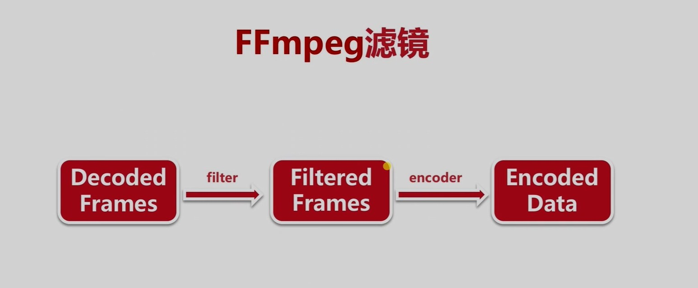
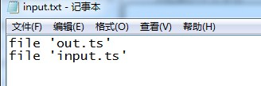

# FFmpeg开发
\*\*

报错集锦：

录制视频时，会显示录制视频的分辨率

ffplay播放视频出错要加上视频的分辨率

**一.FFmpeg代码结构**  

\*\*

**二.FFmpeg处理流程**

**输入文件 ---demuxer----> 编码数据包 ---decoder----> 解析后数据帧 ---encoder---> 编码数据包 ---muxer---> 输出文件**

**三.FFmpeg基本信息查询命令**

\*\*\*\*

\*\*
\*\*

**\-version 显示版本**

**\-demuxers 显示可用的demuxers**

**\-muxers 显示可用的muxers**

**\-devices 显示可用的设备**

**\-codecs 显示所有编解码器**

**\-decoders 显示可用的解码器**

**\-encoders 显示所有的编码器**

**\-bsfs 显示比特流filter**

**\-formats 显示可用的格式**

**\-protocols 显示可用的协议**

**\-filters 显示可用的过滤器**

**\-pix\_fmts 显示可用的像素格式**

**\-sample\_fmts 显示可用的采样格式**

**\-layouts 显示channel名称**

**\-colors 显示识别的颜色名称**

**四.FFmpeg录屏命令**  

\***\*1.（仅\*\*mac**本支持avfoundation）\*\*
\*\*

\****例：****ffmpeg -f avfoundation -i 1 -r 30 out.yuv*\*

 **播放： ffplay -s 2560**x**1600 -pix\_fmt uyvy422 out.yuv**

**\-f : 指定使用 ...... 采集数据，例：使用**avfoundation\*\*\*\* 

**\-i : 指定从哪儿采集数据，它是一个文件索引号，1为电脑桌面**

**\-r : 指定\*\*\*\***录制的\*\*\*\***帧率**

**\-s : 数据分辨率**

**\-pix\_fmt : 像素格式**

\*\***2.（windows支持gdigrab）录制文件保存在cygwin64\\home\\Administrator下**
\*\*

**例：ffmpeg -f gdigrab -framerate 30 -offset\_x 0 -offset\_y 0 -video\_size 1600x900 -i desktop out.mpg**  

 **播放： ffplay out.mpg**  

**\-f : 指定使用 ...... 采集数据，例：使用gdigrab\*\***
\*\*

**\-framerate : 指定录制的帧率**

**\-offset\_x : 左上偏移量X**

**\-offset\_y : 左上偏移量Y**

**\-video\_size : 需要录制的宽度和高度**

**\-i : 指定从哪儿采集数据**

**\-desktop : 告诉ffmpeg录的是屏幕，而不是一个窗口（可以录制窗口，不过得用窗口的ID）**

**五.FFmpeg录音命令**  

\****例：****ffmpeg -f avfoundation -i :0 out.wav*\*

 **播放： ffplay out.wav**

**:0 : 代表音频设备外置的音频**

**:1 : 代表音频设备内置的音频**

\*\***六.FFmpeg分解与复用（格式转换）**
\*\*

\****例1（声音和视频都转换）：****ffmpeg -i out.mp4 -vcodec copy -acodec copy out.flv*\*  

 **播放： ffplay out.flv**

**\-i : 输入文件**  

**\-vcodec copy : 视频编码处理方式**

**\-acodec copy : 音频编码处理方式**

\*\*\****例2（不要声音）：****ffmpeg -i out.mp4 -an -vcodec copy  out.h264*\*
\*\*

 **播放： ffplay out.h264**

**\-an : 不要音频**  

**\******例3（不要视频）：ffmpeg -i out.mp4 -vn  -acodec copy out.aac*****\***  

 **播放： ffplay out.aac**

**\-vn : 不要视频**  

\*\*\*\*\*\*\*\*\*\*\*\***七.处理原始数据命令**  

---
**1.FFmpeg提取YUV数据**  

\****例：****ffmpeg -i ****out****.mp4 -an -c:v rawvideo -pix\_fmt  yuv420p out.yuv*\*  

 **播放： ffplay -s 1600x900 out.yuv**  

**\-an : 不要音频**  

**\-c:v : 使用的视频编码器。例如：rawvideo**

**\-c:a : 使用的音频编码器**

**\-pix\_fmt : 像素格式**

\*\*\*\*\*\*\*\*\*\*\*\***2.FFmpeg提取PCM数据**  

---
\****例：****ffmpeg -i ****out****.mp4 -vn -ar 44100 -ac 2 -f s16le out.pcm*\*  

 **播放： ffplay -ar 44100 -ac 2 -f s16le out.pcm**

**\-vn : 不要视频**  

**\-ar : 音频采样率。例如：44.1K，48K，32K，16K**

**\-ac : 声道数。例如：2-->双声道**

**\-f : 指定使用.....数据存储格式。例如：s16le**

**八.滤镜命令（加去水印，画中画，视频裁剪，音频倍速）**  

**1.FFmpeg滤镜视频裁剪**

\****例：****ffmpeg -i ****out****.mp4 -vf crop=in\_w-200:in\_h-200 -c:v libx264 -c:a copy out.flv*\*  

 **播放： ffplay out.flv**

**\-vf : 视频滤镜。例如：crop=in\_w-200:in\_h-200,原视频宽高减200**  

**\-c:v : 使用的视频编码器。例如：libx264**

**\-c:a : 使用的音频编码器**

**九.音视频的裁剪命令**  

\****例：****ffmpeg -i ****out****.mp4 -ss 00:00:00 -t 10 out.ts*\*  

**\-ss : 代表视频从什么时间点开始裁剪。例如 : 00:00:00,时分秒**  

**\-t : 要裁剪多长时间，以秒为单位**

**十.音视频的合并命令**  

\****例：****ffmpeg -f concat -i input.txt out.mp4*\*  

**\-f : 指定使用.....处理数据。例如：concat(拼接)**  

**\-i : 指定从哪儿采集数据**

**input.txt : txt里内容为 : file 'filename' 格式**

**十一.图片/视频互转命令**  

**1.视频转图片**  

\****例：****ffmpeg -i out.mpg -r 1 -f image2 image-%3d.jpeg*\*  

**\-r : 指定转换\*\*\*\***的\*\*\*\***帧率**  

\*\***-f : 指定使用.....处理数据。例如：image2**
\*\*

\*\*\*\*\*\*\*\*\*\***2.图片转视频**  

---
\****例：****ffmpeg -i image-%3d.jpeg out.mpg*\*  

**十二.直播推/拉流(RTMP、RTSP、HTTP等协议
https://blog.csdn.net/github\_30662571/article/details/72466091

**1.直播推流**  

\****例：****ffmpeg -re -i out.mpg -c copy -f flv rtmp://server/live/streamName*\*  

**\-re : 减慢帧率速度**  

**\-c : 音视频编解码**  

**\-f : 推出去的格式。例如：flv**

**2.直播拉流(m3u8的流就要保存成m3u8格式，保存成的为ts文件)**  

\****例：****ffmpeg -i ****rtmp://server/live/streamName -c copy dump.m3u8***\*  

 **播放： ffplay dump0.ts**
