# CSS
**CSS一些属性：**  

text-decoration:underline;//下划线  

text-decoration:overline;//上划线  

text-decoration:line-through;//删除线  

text-decoration:blink;//文字闪烁效果（有兼容性问题）  

text-decoration:none;//没有任何的修饰


**CSS注释：**

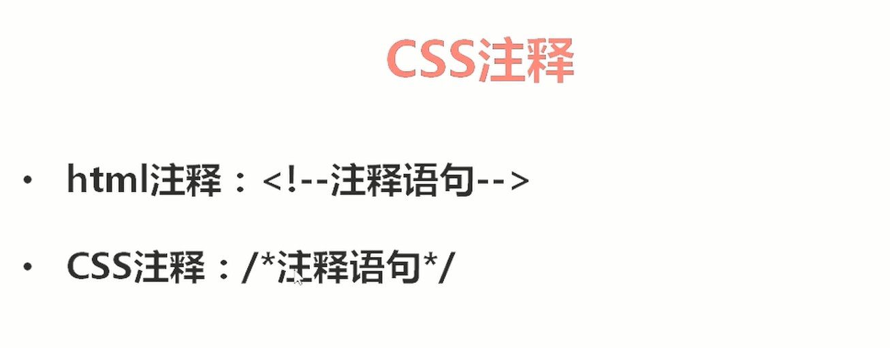


**CSS样式规则\*\*\*\*：**

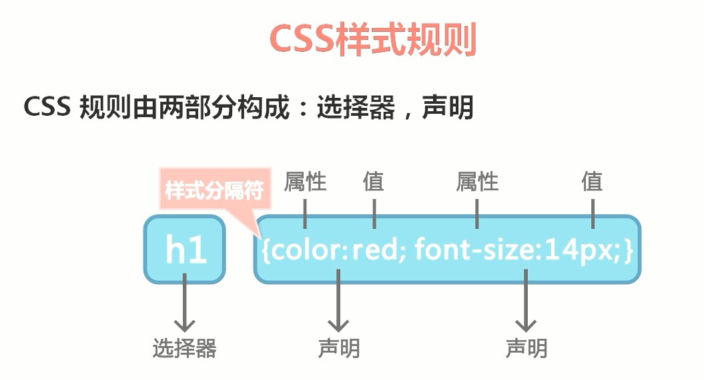

**如何引用CSS样式\*\*\*\*：**  

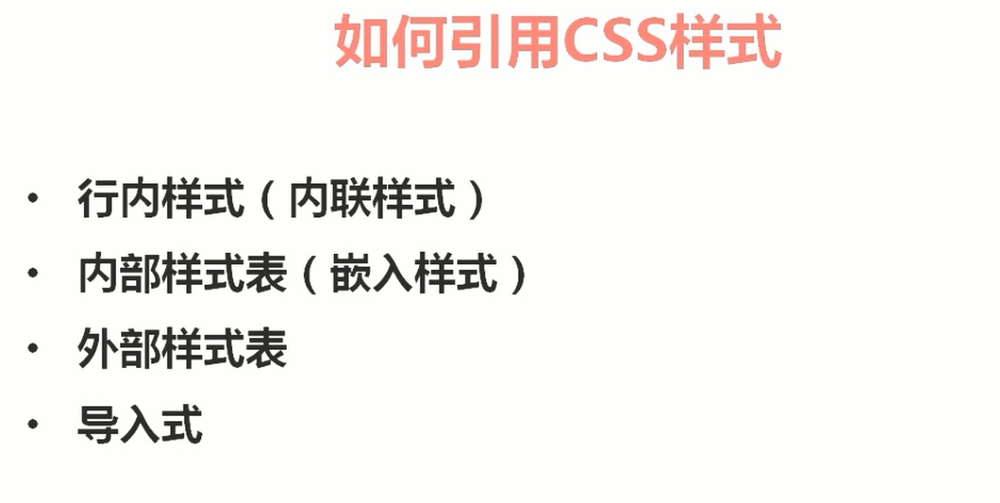

**1.行内样式（内联样式）**  

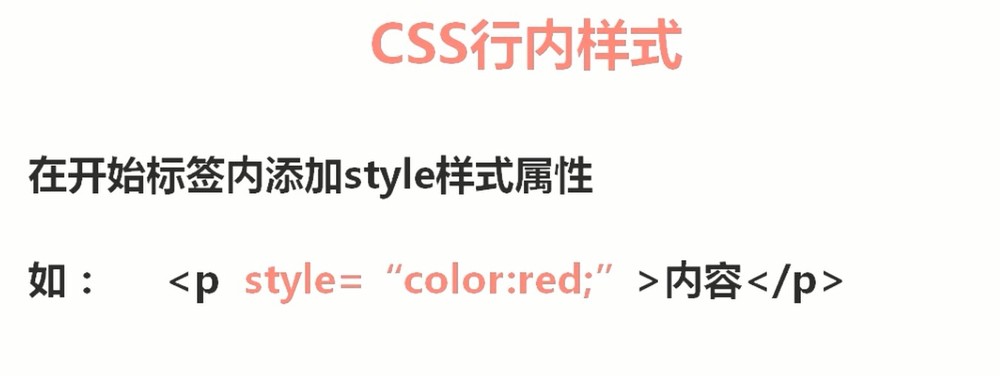

**2.内部样式（嵌入样式）**  

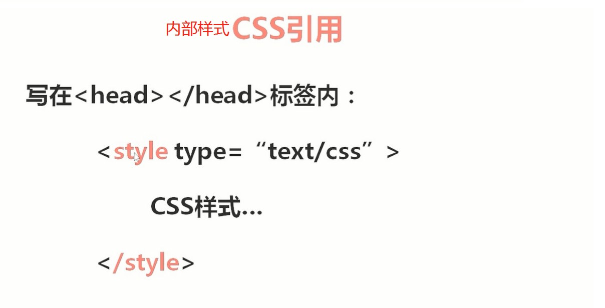

**3.外部样式（外联样式）**  

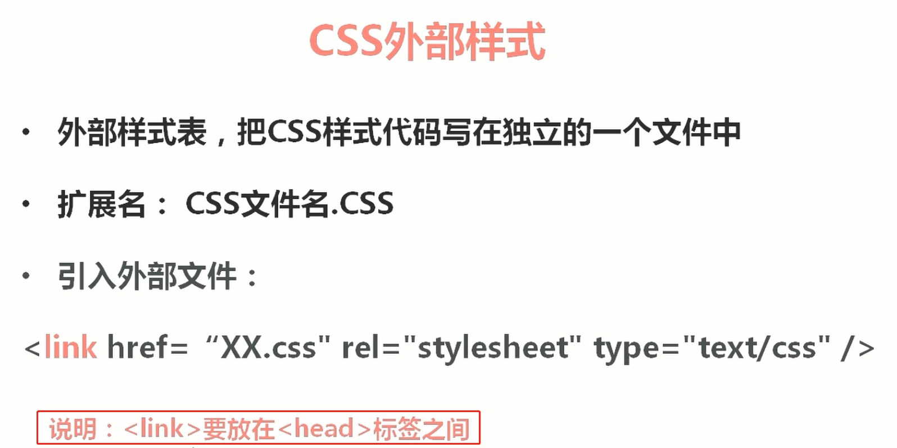

**4.导入式**  

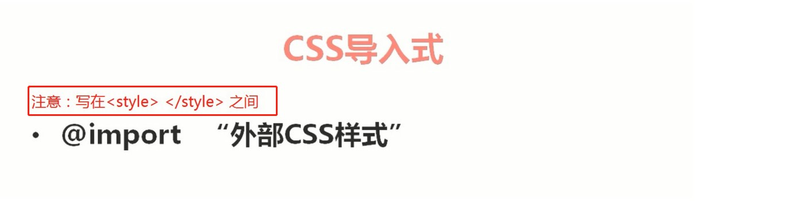


**例1 行内样式（内联样式）:**  

```html
<!DOCTYPE html>
<html lang="en">
<head>
    <meta charset="UTF-8">
    <title>Css样式</title>
</head>
<body>
    <h1 style="font-size:20px;font-family:隶书;color: blue;">CSS层叠样式</h1>

</body>
</html>
```
**例2 内部样式（嵌入样式）:**  

```html
<!DOCTYPE html>
<html lang="en">
<head>
    <meta charset="UTF-8">
    <title>Css样式</title>
    <style type="text/css">
        p{font-size:20px;
          color: blue;
          font-family: "隶书";}
        h1{color: red;
           font-size: 30px;}
    </style>
</head>
<body>
    <h1>CSS层叠样式</h1>
    <p>用于定义HTML内容在浏览器中的显示样式</p>
</body>
</html>
```
**例3 外部样式（外联样式）:**  

    **html文件**

```html
<!DOCTYPE html>
<html lang="en">
<head>
    <meta charset="UTF-8">
    <title>Css样式</title>
    <link rel="stylesheet" type="text/css" href="css.css">
</head>
<body>
    <h1>CSS层叠样式</h1>
    <p>用于定义HTML内容在浏览器中的显示样式</p>
</body>
</html>
```
    **css文件**

```html
p{font-size:20px;
  color: blue;
  font-family: "隶书";}

h1{color: red;
  font-size: 30px;}
```
**例4 导入式:**  

    **html文件**

```html
<!DOCTYPE html>
<html lang="en">
<head>
    <meta charset="UTF-8">
    <title>Css样式</title>
    <style type="text/css">
        @import url(css.css);
    </style>
</head>
<body>
    <h1>CSS层叠样式</h1>
    <p>用于定义HTML内容在浏览器中的显示样式</p>
</body>
</html>
```
    **css文件**  

```html
p{font-size:20px;
  color: blue;
  font-family: "隶书";}

h1{color: red;
  font-size: 30px;}
```
**CSS使用方法区别\*\*\*\*：**  

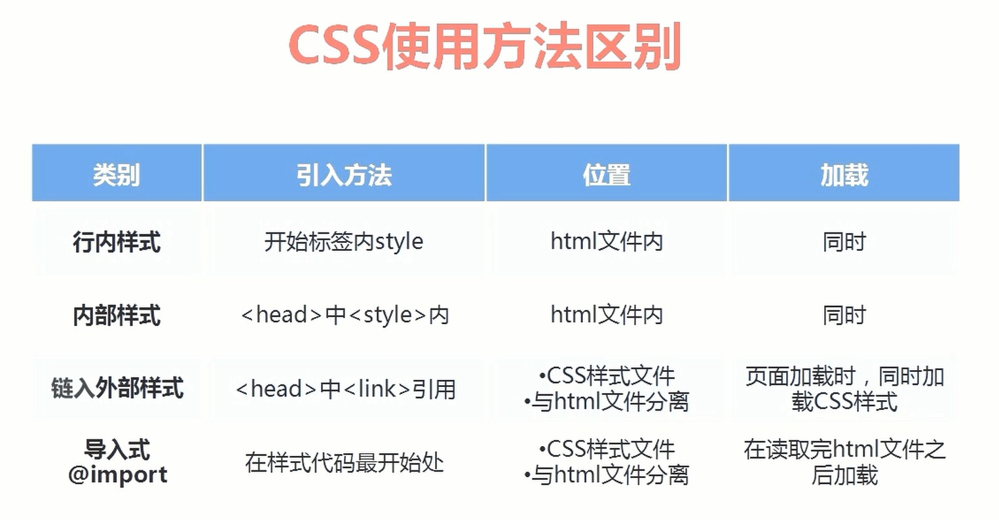

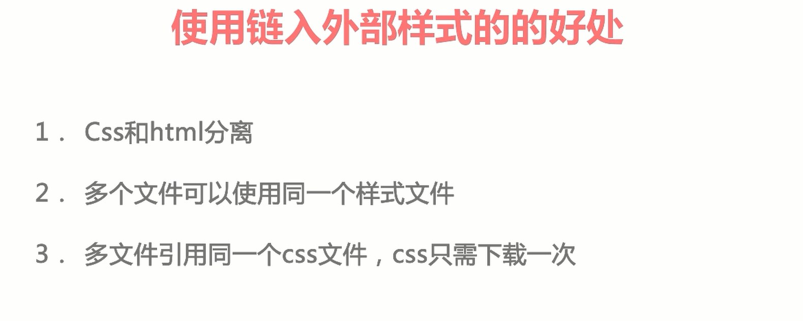

**CSS样式优先级\*\*\*\*：**  

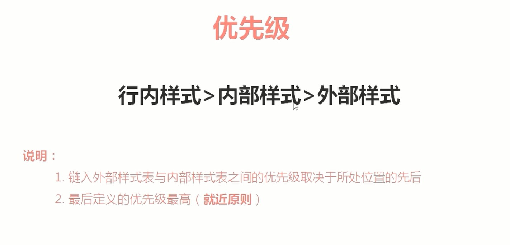

**CSS选择器（都写在<\*\*style\*\*>**</\**style\*>****）***：\*\*  

                                

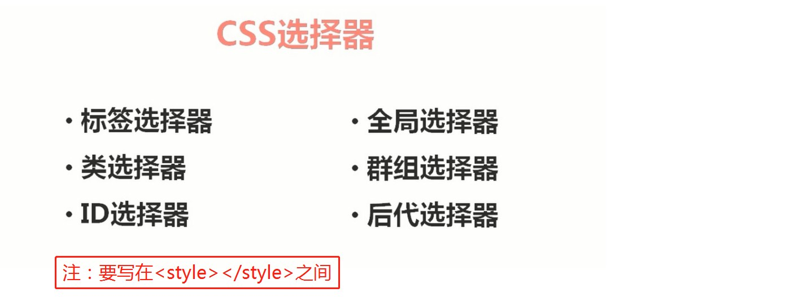


**1.标签选择器**  

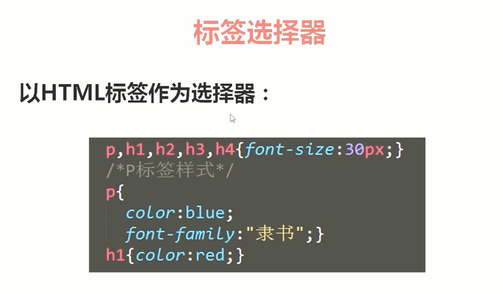

**2.类选择器（一个类选择器可以对应多个标签）**  

    **★\*\*\*\*情景一（多个标签使用同一个名称的类选择器，且每个标签使用效果相同）：**  

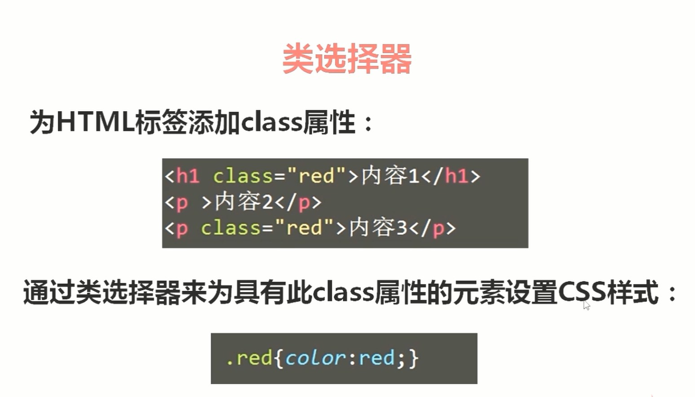

    **★\*\*\*\*情景二（多个标签使用同一个名称的类选择器，且每个类实现效果不同）：**  

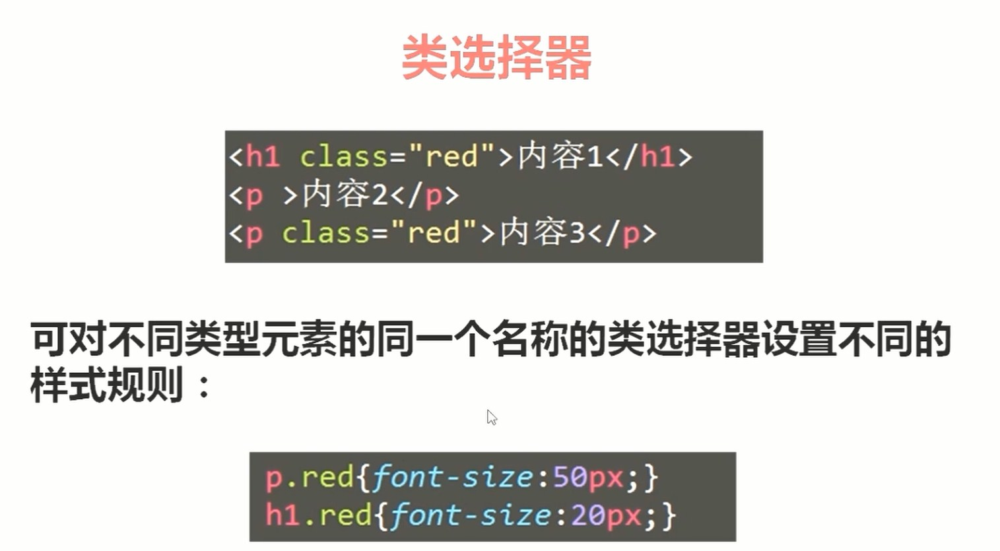

    **★\*\*\*\*情景三（一个标签使用多个类选择器）：**  

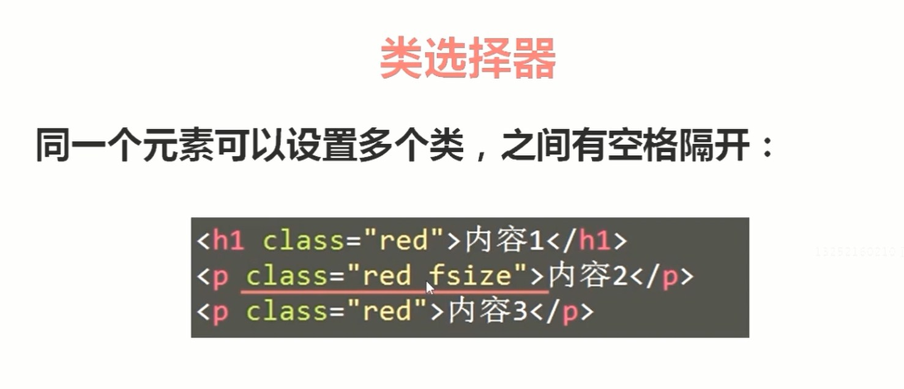

**3.ID选择器（ID是唯一的，一个ID选择器只能对应一个标签）**  

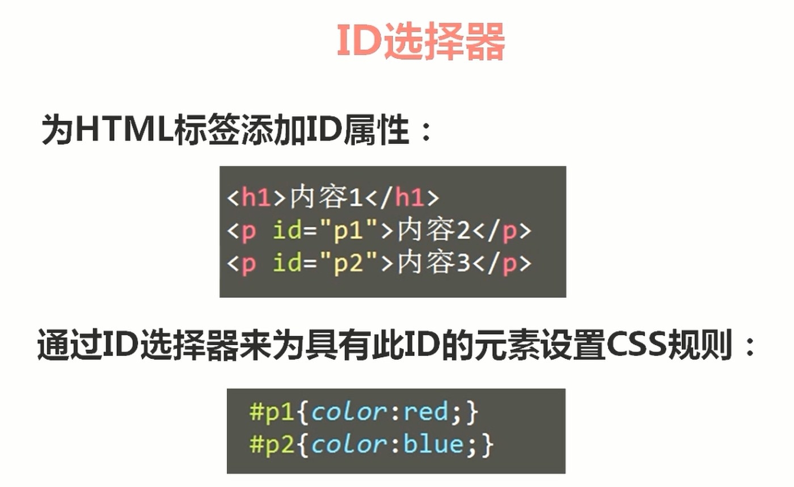

**4.全局选择器**  


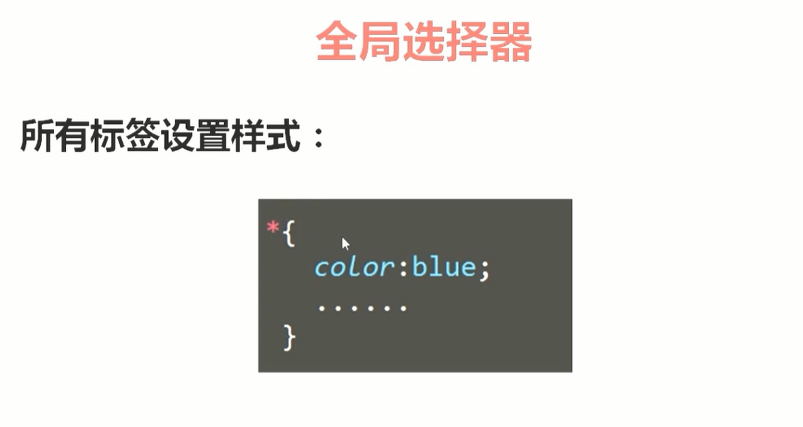

**5.群组选择器**  

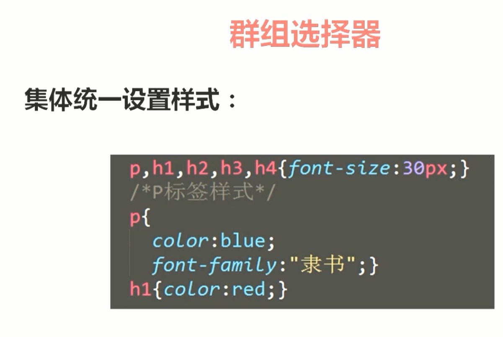

**6.后代选择器**  

    **★\*\*\*\*情景一：**  

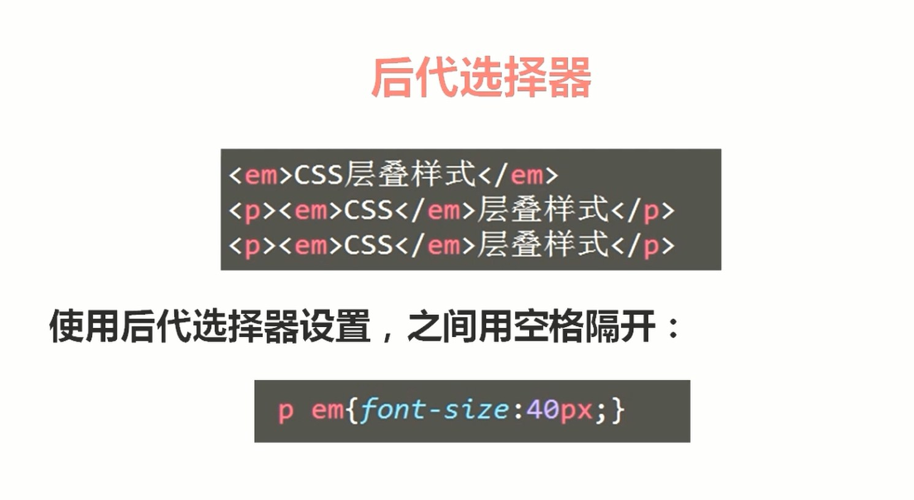

    **★\*\*\*\*情景二：**  

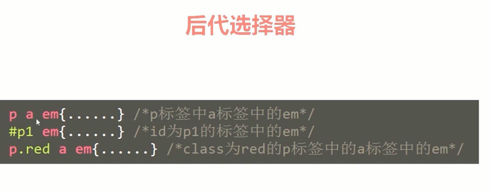


**例1 标签选择器:**  

```html
<!DOCTYPE html>
<html lang="en">
<head>
    <meta charset="UTF-8">
    <title>Css样式</title>
    <style type="text/css">
        h1{
            color: red;
        }
        p{
            color: blue;
        }
    </style>
</head>
<body>
    <h1>CSS层叠样式</h1>
    <p>用于定义HTML内容在浏览器中的显示样式</p>
</body>
</html>
```
**例2.1 类选择器**（多个标签使用同一个**名称的**类选择器，且每个标签使用效果相同）\*\*:\*\*  

```html
<!DOCTYPE html>
<html lang="en">
<head>
    <meta charset="UTF-8">
    <title>Css样式</title>
    <style type="text/css">
        .one{
            color: red;
            font-size: 30px;
        }
    </style>
</head>
<body>
    <h1 class="one">CSS层叠样式</h1>
    <p class="one">用于定义HTML内容在浏览器中的显示样式</p>
</body>
</html>
```
**例2.2 类选择器**（多个标签使用同一个名称的类选择器，且每个类实现效果不同）\*\*:\*\*  

```html
<!DOCTYPE html>
<html lang="en">
<head>
    <meta charset="UTF-8">
    <title>Css样式</title>
    <style type="text/css">
        p.one{
            color: red;
            font-size: 30px;
        }
        h1.one{
            color: blue;
            font-size: 10px;
        }
    </style>
</head>
<body>
    <h1 class="one">CSS层叠样式</h1>
    <p class="one">用于定义HTML内容在浏览器中的显示样式</p>
</body>
</html>
```
**例2.3 类选择器**（一个标签使用多个类选择器）\*\*:\*\*  

```html
<!DOCTYPE html>
<html lang="en">
<head>
    <meta charset="UTF-8">
    <title>Css样式</title>
    <style type="text/css">
        .one{
            color: red;

        }
        .three{
            font-size: 10px;
        }

    </style>
</head>
<body>
    <h1 class="one">CSS层叠样式</h1>
    <p class="one thre">用于定义HTML内容在浏览器中的显示样式</p>
</body>
</html>
```
**例3 ID选择器:**  

```html
<!DOCTYPE html>
<html lang="en">
<head>
    <meta charset="UTF-8">
    <title>Css样式</title>
    <style type="text/css">
        #one{
            color: yellow;
        }

    </style>
</head>
<body>
    <h1 id="one">CSS层叠样式</h1>
    <p>用于定义HTML内容在浏览器中的显示样式</p>
</body>
</html>
```
**伪类：**  


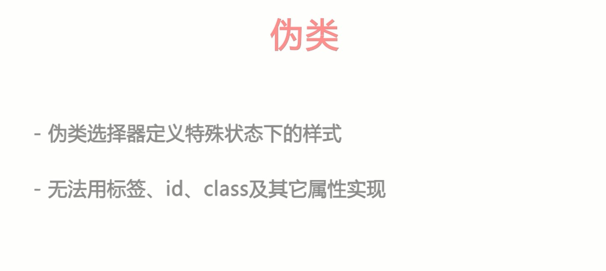

  

**1.链接伪类**

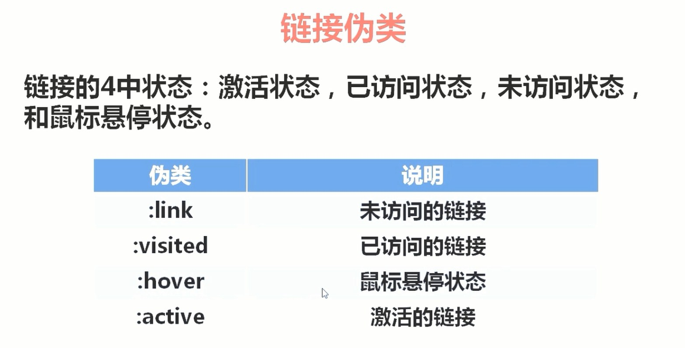

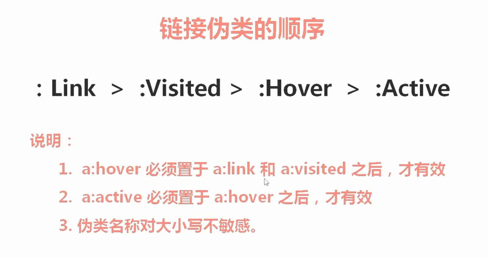


**1.伪类的hover和active其他用途**  

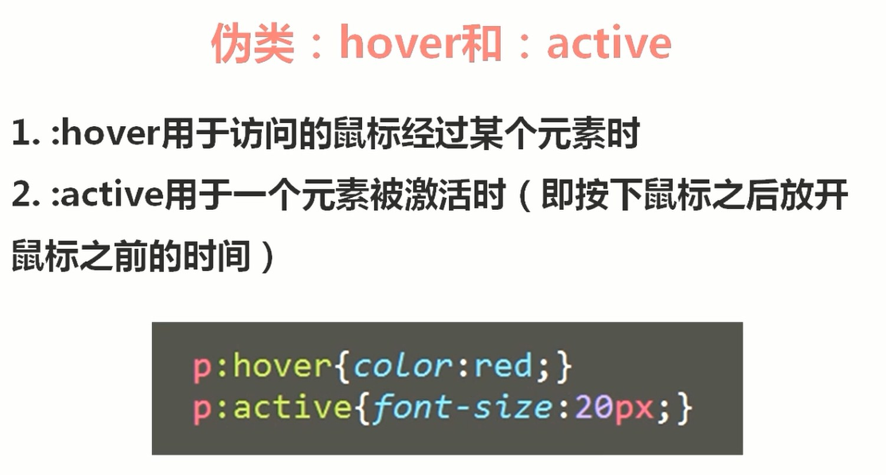

**3.伪类**hover和active的**兼容**  

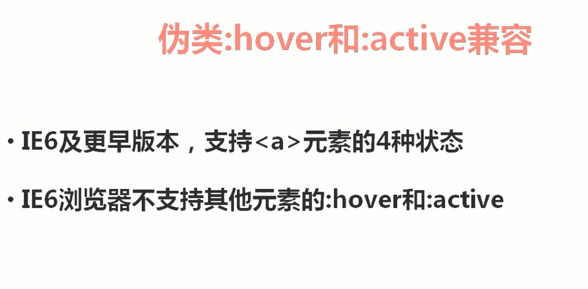


**例1 链接伪类:**  

```html
<!DOCTYPE html>
<html lang="en">
<head>
    <meta charset="UTF-8">
    <title>Css样式</title>
    <style type="text/css">
        a:link{color:blue;} /*未访问状态*/
        a:visited{color: gray;}/*已访问状态*/
        a:hover{color:green;}/*鼠标悬浮状态*/
        a:active{color:orange;}/*激活状态*/

    </style>
</head>
<body>
    <a href="http://www.baidu.com" target="_blank">跳转</h1>
</body>
</html>
```
**例2 伪类hover和active:**  

```html
<!DOCTYPE html>
<html lang="en">
<head>
    <meta charset="UTF-8">
    <title>Css样式</title>
    <style type="text/css">
        p:hover{color:red;}/*鼠标悬浮状态*/
        p:active{font-size:20px;}/*激活状态*/

    </style>
</head>
<body>
    <p>你好</p>
</body>
</html>
```