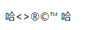
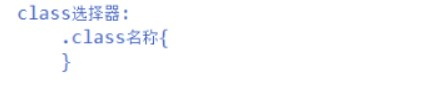

# html笔记
**★本笔记中，用\*\*\*\*●为带有开始和结束两部分构成的，用○为自闭合标记** 

**HTML是超文本标记语言**


\*\*1.\*\*超文本：超链接  

\*\*2.\*\*标记语言：由标记（标签）构成的语言

                                     


**标签：**

```html
<html>  html：html的根标签。代表着html的开始和结束。

  <head>  head：html的头部分。设置网页属性，可以设置标题
      <title>hello word</title>  title： html的标题
  </head>

  <body> body：html的正文部分。放置想要在页面时显示的内容
     hello word
   </body>

</html>   
```
**排版标记：**

   **注释：**

  ●  **：段落标记。\*\*\*\*为字、画、表格等之间留一空白行(如：让静夜思和诗内容之间留一行空白，即用包含诗内容)**

  ○  **：换行标记。\*\*\*\*令字、画、表格等显示于下一行**

---
  **○**  **：水平线。\*\*\*\*插入一条水平线**

  ● **：预设格式。\*\*\*\*令文件按照原始码的排列方式显示（了解）**


```html
<html>
    <head>
        <title>排版</title>
        <meta http-equiv="Content-Type" content="text/html;charset=utf-8">
    </head>
    <body>
        静夜思<br/>
        <hr/>
        <p>
        床前明月光，疑是地上霜。<br/>
        举头望明月，低头思故乡。
        </p>
    </body>
</html>
```
**字体标记：**  

● **：\*\*\*\*加重语气。产生字体加粗Bold的效果**

● **：\*\*\*\*一级标题标签 。变粗变大加宽，程度与级数反比（h1****h6共同点：变粗、自带换行效果。差异：h1字体最大，h6相对h1****h5最小）**

● **：二级标题标签。\*\*\*\*将字体变粗变大加宽**

● **：三级标题标签。将字体变粗变大加宽**

● **：四级标题标签。将字体变粗变大加宽**

● **：五级标题标签。将字体变粗变大加宽**

● **：六级标题标签。将字体变粗变大加宽**

● **：字形标记。\*\*\*\*设置字形、大小（字体大小范围1\~7，7最大）、颜色**

● **：粗体标记。\*\*\*\*产生字体加粗的效果**

● **：强调标记。\*\*\*\*字体出现斜体效果**

● **：斜体标记。\*\*\*\*字体出现斜体效果**

● **：加上底线。\*\*\*\*加上底线，反对**

● **：字体加大。\*\*\*\*令字体稍微加大**

● **：字体缩细。\*\*\*\*令字体稍微缩细**

● **：画线删除。\*\*\*\*为字体加一删除线，反对**

● **：下标字。\*\*\*\*指数**

● **：上标字。上\*\*\*\*标字**

```html
<html>
    <head>
        <title>排版</title>
        <meta http-equiv="Content-Type" content="text/html;charset=utf-8">
    </head>
    <body>
    <h1>静夜思<br/></h1>
        <hr/>
        <p>
        <font color="red" size="7">床</font>前明<small>月</small>光，<strong>疑</strong>是地上霜。<br/>
            <u>举</u> <i>头</i> <big>望</big> <b>明</b>月，<strike>低</strike> <em>头</em> <sub>思</sub> <sup>故</sup>乡。
        </p>
    </body>
</html>
```


 转义标记：

<  小于号：<，或者显示标记。

**\>** 大于号：>，或者显示标记。

**&&** 可用于显示其它特殊字符。

**"** 引号： " 。

**®** 已注册符号：**®。**

**©** **版权符号：**©。

**™** **商标符号：**™

** ** 空格。

```html
<html>
    <head>
        <title>排版</title>
        <meta http-equiv="Content-Type" content="text/html;charset=utf-8">
    </head>
    <body>
        哈<>®©™ 哈
    </body>
</html>
```



 **列表标签(无序列表ul、有序列表ol，层次列表dl)：**

 ●\*\*：\*\* **无序列表，前边没有序号，不设置type属性默认是用：●** **做前标，可以通过type属性更改样式**。

 ● **：** **有序列表，前边有序号，不设置type属性默认是用：1，2，3，......做前标，可以通过type属性更改。**

    ● **：\*\*\*\*有序和无序列表展示的内容**

```html
    <p>
    无序列表：前边没有序号，ul不写type默认是 · 表示,可以通过ul的type属性更改。
        <ul type="circle">
            <li>敲代码</li>
            <li>跑步</li>
            <li>玩游戏</li>
        </ul>
    </p>
    <hr/>

    <p>
    有序列表：前边有序号，ol不写type默认是 1,2,3,.... 排    序,可以通过ol的type属性更改。
        <ol type="A">
            <li>敲代码</li>
            <li>跑步</li>
            <li>玩游戏</li>
        </ol>
    </p>
    <hr/>
```


● **：** **层次列表**

   ● **：** **列表的标题**  

   ● **：** **列表标题下包含的内容**

```html
    <p>
    分类列表：分层次展示。dt：是标题。dd:是标题下的内容。
        <dl>
            <dt>RPG游戏</dt>
            <dd>仙剑奇侠传</dd>
            <dd>轩辕剑</dd>
            <dd>剑侠情缘</dd>

            <dt>棋牌类游戏</dt>
            <dd>斗地主</dd>
            <dd>飞行棋</dd>
            <dd>围棋</dd>
        </dl>
    </p>
    <hr/>
```


 **图形标记：**

○ ** ：** **src要显示的图片（图片和html文件在一个目录下可以直接引用）,border边框的宽度，width和height图片的宽和高，alt图片显示不出来的提示，title鼠标放在图片上的提示。**

```html

```


 **A标签：**

● **跳转：** **设置要跳转的本地页面或网页**。

1.跳转到本地页面

```html
<a href="xxx.html">点我跳转同目录下html</a>
```
**2.跳转到网页**

```html
<a href="https://www.baidu.com" target="_blank">百度</a>
```
3.跳转到邮箱

```html
<a href="thunder:xxx@163.com" target="_blank">百度</a>
```
**4.下载链接**

```html
<a href="thunder://xxxxxx" target="_blank">百度</a>
```
● **锚功能：**

    1.跳转到本页面锚点。


```html
<a name="_abc"></a>  用 _ 来设置锚点

<a href="#_abc">回到abc位置</a>  用 # 表示当前页面， _ 表示找到锚点。
```
    **2.跳转到不同页面锚点。**  


**表格标签：**

**● ：\*\***表格,border 大于0以上就是有边框。\*\*

    **● ：\*\***行。\*\*

    \****● ：****\*\*\**列。\*\*

    \****● ：****\*\*\**列，加粗居中。\*\*

**1.里的表格属性**

               


            


                


                          


**2.表格标题**  


**3.表格结构及其标签属性**  


        


**4.里的标签属性**  


**5.跨列属性colspan**  


**6.跨行属性rowspan**  


**表格例1：**

```html
<table border="1">
        <tr>
            <td align="center">
                <b>姓名</b>
            </td>
            <th>
                号码
            </th>
        </tr>
        <tr>
            <td>
                tom
            </td>
            <td>
                666
            </td>
        </tr>
        <tr>
            <td>
                query
            </td>
            <td>
                 1111
            </td>
        </tr>
    </table>
```


**表格例2：**  

```html
<!DOCTYPE html>
<html>
<head>
    <meta  http-equiv="Content-Type" content="text/html;charset=utf-8">
    <title>hello</title>
</head>
<body>
    <table border="6" width="500px" bgcolor="#f2f2f2" cellspacing="0" cellpadding="5px"
    align="center">
        <caption>前端工程师平均工资</caption>
        <thead align="center" valign="middle">
            <tr>
                <th rowspan="2">城市</th>
                <th colspan="2">2014</th>

                <th rowspan="2">2015</th>
                <th rowspan="2">2016</th>
            </tr>
            <tr>

                <th>上半年</th>
                <th>下半年</th>

            </tr>
        </thead>
        <tbody align="center" valign="middle">
            <tr>
                <td>北京</td>
                <td>8000</td>
                <td>9000</td>
                <td>10000</td>
                <td>12000</td>
            </tr>
            <tr>
                <td>上海</td>
                <td>6000</td>
                <td>7000</td>
                <td>8000</td>
                <td>10000</td>
            </tr>
        </tbody>
        <tfoot align="center" valign="middle">
            <tr>
                <td><a href="https://www.baidu.com">平均</a></td>
                <td>7000</td>
                <td>8000</td>
                <td>9000</td>
                <td>11000</td>
            </tr>
        </tfoot>
    </table>
</body>
</html>
```


**表单标签：**

● **：**

表单标记，决定单一表单的运作模式。

   **action 表示提交的位置，# 代表当前页面。**

    ○：**定义文本输入框、单/多选、按钮控件。**

         type 定义要用的控件。（text单行文本输入框、radio单选、checkbox多选、submit提交、reset重置）。

         **★**name 定义控件的键。文本框输入的内容或选择框里的value参数就是值，凑成键值对提交给服务器。

          value 控件默认的值或按钮名称。单/多选框可以用来定义每个选项代表的值进行提交。


    ● **：**下拉控件

        **★**name 定义控件的键。

        ● **：**下拉选项

                    value 控件的值。


    ● **：**多行文本输入框，不能用value参数，可以将值写在标签体中。  

         **★**name 定义控件的键。

            **rows:行数**

            **cols:每行多少字**

\*\***1.表单及其标签**
\*\*


**1.1表单的标签**  


**1.1表单的操作**  


**2.表单的input标签**  


                        


    \*\*\*\*2.**1 标签的text单行文本域：**  


                                    


    \*\*\*\*2.**2 标签的file文件域：**  

    


    \*\*\*\***2.3 标签的单选框（name要相同）：**


    \*\*\*\***\******2.4 标签的*****\*复选框（name不必相同,但最好设置成相同name便于提交服务器判断是那组多选）：**  


    \*\*\*\***2.5 标签的按钮**  


    **2.6 标签的图像提交按钮（点击也能起到提交的作用）**  


    **2.7 标签的隐藏域（想让用户看不到且我们要传送给服务器一些数据时就用这个）**  


**3.表单的select下拉标签及其属性**  

    


**4.表单的optgroup分组下拉标签及其属性**  


**5.表单的textarea多行文本域标签及其属性**


**表单例1：**  

```html
<form action="#">
        用户名<input type="text" name="userName"/>  name是 键，文本框输入 值，凑成键值对。<br/>
        性别：<input type="radio" name="sex" value="male"/>男<input type="radio" name="sex" value="girl"/>女<br/>
        爱好: <input type="checkbox" name="habbit" value="smork"/>抽烟
              <input type="checkbox" name="habbit" value="drink"/>喝酒
              <input type="checkbox" name="habbit" value="tangtou"/>烫头<br/>
        学历:<select name="edu">
                <option value="zk">专科</option>
                <option value="bk">本科</option>
                <option value="ss">研究生</option>
             </select><br/>
        个人说明：<textarea rows="10" cols="35" name="desc">你好</textarea><br/>
        近照：<input type="file" name="file"><br/>
        <input type="submit" value="提交"><input type="reset" value="重置">
    </form>
```


**from的action：**  

```html
<!DOCTYPE html>
<html>
<head>
    <title>form的action</title>
</head>
<body>
    <h1 align="center">注册信息</h1>
    <hr color="#336699"/>
    <form action="action.php" >
        <table width="600px" bgcolor="#f2f2f2" align="center">
            <tr>
                <td></td>
                <td><input type="button" value="来点我" name="button">
                    <input type="submit" value="提交" name="submit">
                    <input type="reset" value="重置" name="reset">
                    <input type="image" name="image_button" src="image/image-button.png"></td>
            </tr>
            <tr>
                <td></td>
                <td><input type="hidden" name="hidden" value="这是一个用户注册信息"></td>   <!-- 想让用户看不到且我们要传送给服务器一些数据时就用这个 -- >
            </tr>
        </table>
    </form>
</body>
</html>
```


**表单例2（表单input标签）：**  

```html
<!DOCTYPE html>
<html>
<head>
    <title>表单</title>
</head>
<body>
    <h1 align="center">注册信息</h1>
    <hr color="#336699"/>
    <form >
        <table width="600px" bgcolor="#f2f2f2" align="center">
            <tr>
                <td>姓名：</td>
                <td><input type="text" name="username" size="25" maxlength="6" placeholder="请输入姓名" /></td>
            </tr>
            <tr>
                <td>邮箱：</td>
                <td><input type="text" name="email" value="@163.com" /></td>
            </tr>
            <tr>
                <td>密码：</td>
                <td><input type="password" name="pwd" size="25" maxlength="6" placeholder="请输入密码" /></td>
            </tr>
            <tr>
                <td>确认密码：</td>
                <td><input type="password" name="pwd_confirm" size="25" maxlength="6" placeholder="请再输入密码" /></td>
            </tr>
            <tr>
                <td>上传照片：</td>
                <td><input type="file" name="file"></td>
            </tr>
            <tr>
                <td>性别：</td>
                <td>男<input type="radio" name="sex" value="man" />
                    女<input type="radio" name="sex" value="woman" />
                    保密<input type="radio" name="sex" value="bm" checked/></td>
            </tr>
            <tr>
                <td>爱好：</td>
                <td>读书<input type="checkbox" name="dx" value="read" >
                    跳舞<input type="checkbox" name="dx" value="dance">
                    唱歌<input type="checkbox" name="dx" value="sing"></td>
            </tr>
            <tr>
                <td></td>
                <td><input type="button" value="来点我" name="button">
                    <input type="submit" value="提交" name="submit">
                    <input type="reset" value="重置" name="reset">
                    <input type="image" name="image_button" src="image/image-button.png"></td>
            </tr>
            <tr>
                <td></td>
                <td><input type="hidden" name="hidden" value="这是一个用户注册信息"></td>
            </tr>
        </table>
    </form>
</body>
</html>
```


**表单例3（下拉表单）：**  

```html
<!DOCTYPE html>
<html>
<head>
    <title>下拉表单</title>
</head>
<body>
    <h1 align="center">注册信息</h1>
    <hr color="#336699"/>
    <form >
        <table width="600px" bgcolor="#f2f2f2" align="center">
            <tr>
                <td>城市：</td>
                <td>
                    <select name="city">
                    <option value="xz">--请选择--</option>
                    <option value="bj" selected>北京</option>
                    <option value="tj">天津</option>
                    <option value="hb">河北</option>
                    <option value="sh">上海</option>
                    <option value="fj">福建</option>
                    <option value="xm">厦门</option>
                    </select>
                </td>
            </tr>
            <tr>
                <td>城市：</td>
                <td>
                    <select name="city" size="3">
                    <option value="xz">--请选择--</option>
                    <option value="bj">北京</option>
                    <option value="tj" selected>天津</option>
                    <option value="hb">河北</option>
                    <option value="sh">上海</option>
                    <option value="fj">福建</option>
                    <option value="xm">厦门</option>
                    </select>
                </td>
            </tr>
            <tr>
                <td>城市：</td>
                <td>
                    <select name="city" multiple>
                    <option value="xz">--请选择--</option>
                    <option value="bj" selected>北京</option>
                    <option value="tj" selected>天津</option>
                    <option value="hb" selected>河北</option>
                    <option value="sh">上海</option>
                    <option value="fj">福建</option>
                    <option value="xm">厦门</option>
                    </select>
                </td>
            </tr>
            <tr>
                <td></td>
                <td><input type="button" value="来点我" name="button">
                    <input type="submit" value="提交" name="submit">
                    <input type="reset" value="重置" name="reset">
                    <input type="image" name="image_button" src="image/image-button.png"></td>
            </tr>
        </table>
    </form>
</body>
</html>
```


**表单例4（下拉分组）：**  

```html
<!DOCTYPE html>
<html>
<head>
    <title>下拉分组</title>
</head>
<body>
    <h1 align="center">注册信息</h1>
    <hr color="#336699"/>
    <form >
        <table width="600px" bgcolor="#f2f2f2" align="center">
            <tr>
                <td>城市：</td>
                <td>
                    <select name="city">
                    <option value="xz">--请选择--</option>
                    <optgroup label="华北">
                    <option value="bj">北京</option>
                    <option value="tj">天津</option>
                    <option value="hb">河北</option>
                    </optgroup>
                    <optgroup label="华东">
                    <option value="sh">上海</option>
                    <option value="fj">福建</option>
                    <option value="xm">厦门</option>
                    </optgroup>
                    </select>
                </td>
            </tr>
            <tr>
                <td></td>
                <td><input type="button" value="来点我" name="button">
                    <input type="submit" value="提交" name="submit">
                    <input type="reset" value="重置" name="reset">
                    <input type="image" name="image_button" src="image/image-button.png"></td>
            </tr>
        </table>
    </form>
</body>
</html>
```


**表单例5（多行文本域）：**  

```html
<!DOCTYPE html>
<html>
<head>
    <title>多行文本域</title>
</head>
<body>
    <h1 align="center">注册信息</h1>
    <hr color="#336699"/>
    <form >
        <table width="600px" bgcolor="#f2f2f2" align="center">
            <tr>
                <td>简介：</td>
                <td>
                    <textarea name="jj" >1234567</textarea>
                </td>
            </tr>
            <tr>
                <td></td>
                <td><input type="button" value="来点我" name="button">
                    <input type="submit" value="提交" name="submit">
                    <input type="reset" value="重置" name="reset">
                    <input type="image" name="image_button" src="image/image-button.png"></td>
            </tr>
        </table>
    </form>
</body>
</html>
```


 **CSS：**

1.CSS结合方式

**方式一：**

   html标签上加上style属性，属性的值填写Css代码。

   所有标签都有style属性。  


```html
<p style="color:red;">This is my HTML page</p>
```
**方式二：**

**使用head标签中的style标签，设置页面样式，style中填写Css代码。**


```html
<html lang="en">
<head>
    <meta http-equiv="Content-Type" content="text/html;charset=utf-8">
    <style type="text/css">
        p{
            color:red;
        }
    </style>
</head>
<body>
    <p>This is my HTML page</p>
</body>
</html>
```
**方式三：**

**使用link将外部css文件引入到当前页面。**

```html
<html lang="en">
<head>
    <meta http-equiv="Content-Type" content="text/html;charset=utf-8">
    <link rel="stylesheet" type="text/css" href="p.css">
</head>
<body>
    <p>This is my HTML page</p>
</body>
</html>
```
    p.css文件


```html
p{
    color:red;
}
```
**2.CSS选择器：**

**标签选择器：**


  

**例:**  

```html
<html lang="en">
<head>
    <meta http-equiv="Content-Type" content="text/html;charset=utf-8">
    <style type="text/css">
        p{
            color:red;
        }
    </style>
</head>
<body>
    <p>This is my HTML page</p>
</body>
</html>
```
**id选择器：**


**例:**

```html
<html lang="en">
<head>
    <meta http-equiv="Content-Type" content="text/html;charset=utf-8">
    <style>
        #one{
            color: red;
        }
    </style>
</head>
<body>
    <p id="one">This is my HTML page</p>
</body>
</html>
```
**class选择器：**



**例:**  

```html
<html lang="en">
<head>
    <meta http-equiv="Content-Type" content="text/html;charset=utf-8">
    <style>
        .one{
            color: red;
        }
    </style>
</head>
<body>
    <p class="one">This is my HTML page</p>
</body>
</html>
```
**伪类选择器：**  


  

**例:**  

```html
<html lang="en">
<head>
    <meta http-equiv="Content-Type" content="text/html;charset=utf-8">
    <style>
        p:link{
            color: red;
        }

        p:visited{
            color: red;
        }

        p:hover{
            color: red;
        }

        p:active{
            color: red;
        }
    </style>
</head>
<body>
    <p class="one">This is my HTML page</p>
</body>
</html>
```
**3.div和span标签：**  

\*\*div : 是块状元素的代表，默认在标准流中换行显示；
span : 是行内元素的代表，不换行。
\*\*\*\*它们之间可以通过display属性来强制转换\*\*\*\*\*
\*\*


  

**例:**  

```html
<html lang="en">
<head>
    <meta http-equiv="Content-Type" content="text/html;charset=utf-8">
</head>
<body>
    aaaaa<div>aaaa</div>aaa<br/>
    aaaa<span>bbbb</span>
</body>
</html>
```
