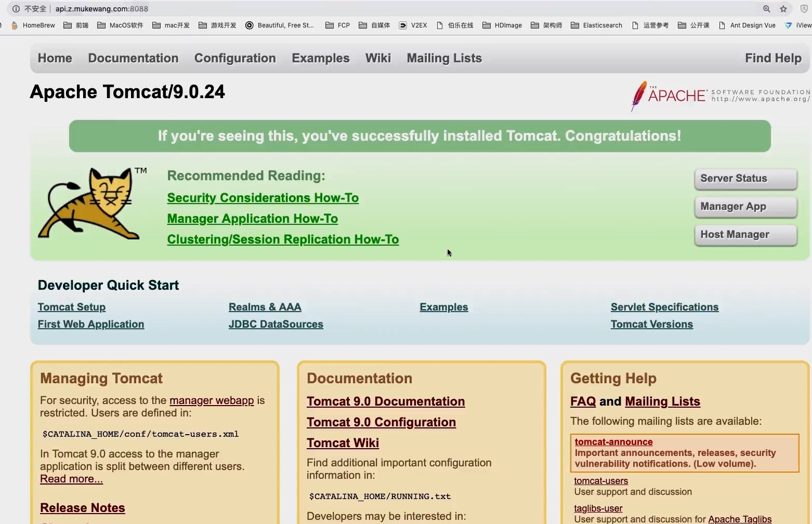

# 3.服务器Tomcat安装
# **一.部署前端Tomcat**
**注意：#表示公用的操作；##表示要根据自己操作的实际名去操作**  

**1.使用ftp工具（FileZille）上传Tomcat压缩包到某目录下，如下：**

```bash
#1.使用工具将Tomcat文件拖入 /home/software/ 目录下
/home/software/
```
**2.解压Tomcat压缩包：**

```bash
##解压 /home/software/apache-tomcat-9.0.24.tar.gz 目录下的Tomcat压缩包
tar -zxvf apache-tomcat-9.0.24.tar.gz
```
**3.将解压后的Tomcat文件夹重命名：**

```bash
##将解压后的Tomcat文件夹重命名
mv apache-tomcat-9.0.24 tomcat-frontend
```
**4.将**重命名**后tomcat-frontend文件夹移动到/usr/local/下：**

```bash
##将重命名后 tomcat-frontend 文件夹移动到 /usr/local/ 下
mv tomcat-frontend/ /usr/local/
```
**5.启动Tomcat：**

```bash
#1.进入 /usr/local/ 目录下
cd /usr/local/

#2.显示 /usr/local/ 目录下的内容
ll

##3.进入 /usr/local/tomcat-frontend/ 目录下
cd tomcat-frontend/


#4.显示 /usr/local/tomcat-frontend/ 目录下的内容
ll

#5.进入 /usr/local/tomcat-frontend/bin/ 目录下
cd bin/

#3.启动Tomcat
./startup.sh
```
**6.检查启动是否成功**：

    **网站输入服务器公网ip地址:8080或者网址域名:8080**


# 二.部署后台Tomcat
**1.解压已有的Tomcat压缩包：**

```bash
##解压 /home/software/apache-tomcat-9.0.24.tar.gz 目录下的Tomcat压缩包
tar -zxvf apache-tomcat-9.0.24.tar.gz
```
**2.将解压后的Tomcat文件夹重命名：**

```bash
##将解压后的Tomcat文件夹重命名
mv apache-tomcat-9.0.24 tomcat-api
```
**3.将重命名后的tomcat-api文件夹移动到/usr/local/下：**

```bash
##将重命名后 tomcat-api 文件夹移动到 /usr/local/ 下
mv tomcat-api/ /usr/local/
```
**4.不能和前端端口号冲突，所以要修改后台tomcat对应的端口号：**

```bash
#1.进入 /usr/local/ 目录下
cd /usr/local/

#2.显示 /usr/local/ 目录下的内容
ll

##3.进入 /usr/local/tomcat-api/ 目录下
cd tomcat-api/

#4.显示 /usr/local/tomcat-api/ 目录下的内容
ll

#5.进入 /usr/local/tomcat-api/conf/ 目录下
cd conf/

#6.显示 /usr/local/tomcat-api/conf/ 目录下的内容
ll

#7.用vim修改tomcat-api/conf/目录下 server.xml文件的端口号
vim server.xml
```
    **改为进入server.xml文件后修改端口号8080**  


**5.修改完server.xml后启动tomcat-api：**

```bash
#1.返回上级目录到 /usr/local/tomcat-api/ 下
cd ..

#2.显示 /usr/local/tomcat-api/ 目录下的内容
ll

#3.进入 /usr/local/tomcat-api/bin/ 目录下
cd bin/

#3.启动Tomcat
./startup.sh
```


